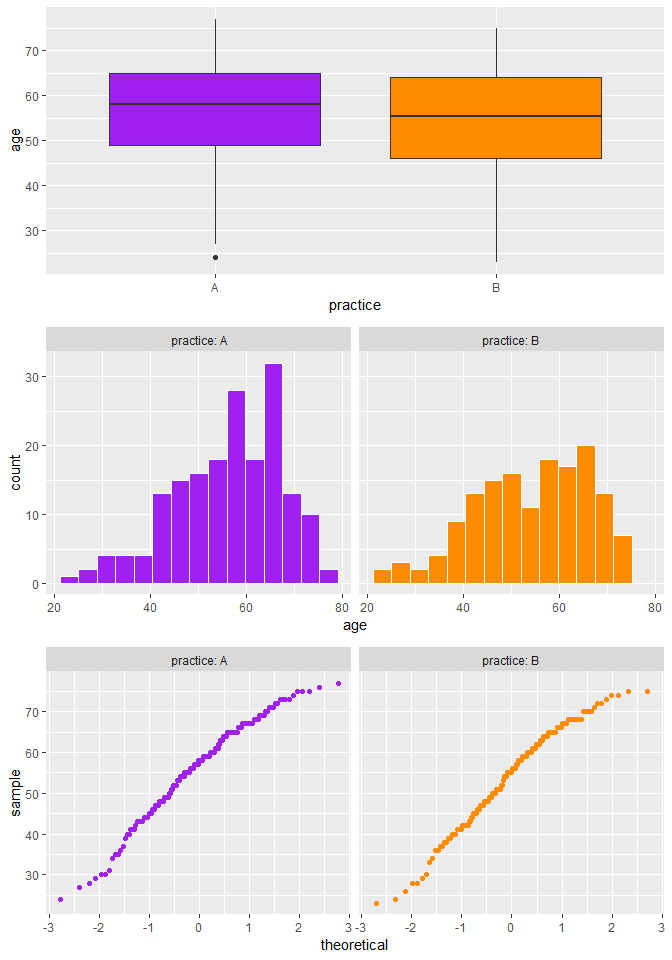
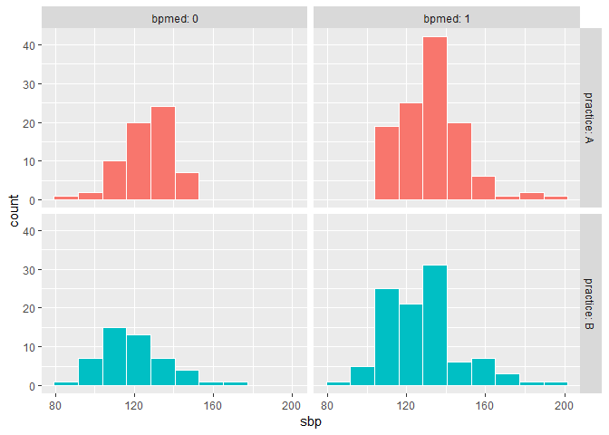
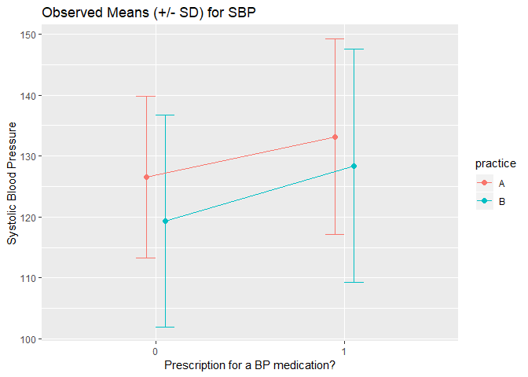
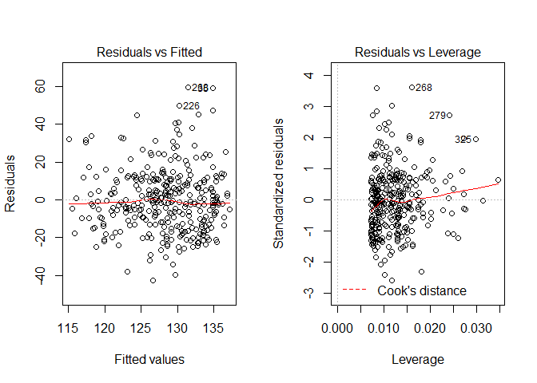

432 Homework 1 Answer Sketch
================
Due 2019-02-01. Version: 2019-02-01

-   [Setup and Data Ingest](#setup-and-data-ingest)
-   [Question 1 (25 points)](#question-1-25-points)
    -   [Creating the BMI and BMI Category variables](#creating-the-bmi-and-bmi-category-variables)
    -   [Checking for Missing Values](#checking-for-missing-values)
    -   [First Attempt at Table 1](#first-attempt-at-table-1)
    -   [Making Decisions about Summary Approaches](#making-decisions-about-summary-approaches)
        -   [A closer look at Age](#a-closer-look-at-age)
    -   [Final Table 1 and Notes](#final-table-1-and-notes)
        -   [Describing the Table in a few sentences](#describing-the-table-in-a-few-sentences)
-   [Question 2. (10 points)](#question-2.-10-points)
    -   [We'll start with a summary table and graph](#well-start-with-a-summary-table-and-graph)
    -   [A Two-Way ANOVA model with Interaction](#a-two-way-anova-model-with-interaction)
    -   [A Two-Way ANOVA model without interaction (Main Effects only)](#a-two-way-anova-model-without-interaction-main-effects-only)
-   [Question 3 (10 points)](#question-3-10-points)
    -   [ANCOVA: Adding age to the "no interaction" model](#ancova-adding-age-to-the-no-interaction-model)
    -   [Comparison to the "no interaction" model via ANOVA](#comparison-to-the-no-interaction-model-via-anova)
    -   [Comparison to the "no interaction" model via fit quality summaries](#comparison-to-the-no-interaction-model-via-fit-quality-summaries)
    -   [Comparison to the "no interaction" model in terms of conclusions](#comparison-to-the-no-interaction-model-in-terms-of-conclusions)
    -   [Regression diagnostics for the ANCOVA model](#regression-diagnostics-for-the-ancova-model)
-   [Question 4. (5 points)](#question-4.-5-points)

Setup and Data Ingest
---------------------

**Note**: It's good practice not to load any more than you must, although you should install [the packages listed on our site](https://github.com/THOMASELOVE/2019-432/blob/master/packages.md).

``` r
library(skimr); library(broom); library(tableone)
library(janitor); library(tidyverse)

skim_with(numeric = list(hist = NULL), 
          integer = list(hist = NULL))
```

**Note**: I loaded the data for this assignment into a subfolder of my R Project directory for Homework 1 called `data`. Hence, I use the following command to load in the `hbp330.csv` data.

``` r
hbp330 <- read_csv("data/hbp330.csv") %>%
    clean_names()
```

Question 1 (25 points)
======================

**Note**: I don't expect or need you to include the question in your response to homework assignments. I include them here to provide some context for the sketch.

> Build a Table 1 to compare the subjects in practice A to the subjects in practice B on the following nine variables: age, race, Hispanic ethnicity, sex, primary insurance, body mass index, BMI category, and systolic and diastolic blood pressure. Make the Table as well as you can within R, and display the result as part of your HTML file. Include a description of the results of your Table 1 that does not exceed 100 words, using complete English sentences.

Creating the BMI and BMI Category variables
-------------------------------------------

With the metric system, the formula for BMI is weight (in kilograms) divided by the square of height (in meters.)

``` r
hbp330 <- hbp330 %>%
  
  # first we'll create the bmi values
  
  mutate( bmi = weight / (height*height) ) %>%
  
  # next we'll create the bmi categories with case_when
  # note that values of NA in bmi return NA in bmi_cat, too
  
  mutate( bmi_cat = case_when(
    bmi < 18.5 ~ "Underweight",
    bmi < 25 ~ "Normal",
    bmi < 30 ~ "Overweight",
    bmi >= 30 ~ "Obese")) %>%
  
  # finally we arrange the bmi_cat by the median(bmi) levels
  # we could instead have arranged by hand using fct_relevel
  
  mutate( bmi_cat = fct_reorder( bmi_cat, bmi, median ))
```

As a sanity check, let's ensure that the subjects in each `bmi_cat` have `bmi` values as we expect...

``` r
hbp330 %>% group_by(bmi_cat) %>% skim(bmi)
```

    Skim summary statistics
     n obs: 330 
     n variables: 21 
     group variables: bmi_cat 

    -- Variable type:numeric ------------------------------------------------------------------------------------
         bmi_cat variable missing complete   n  mean   sd    p0   p25   p50
     Underweight      bmi       0        2   2 17.41 0.97 16.73 17.07 17.41
          Normal      bmi       0       25  25 22.96 1.67 19.68 21.41 23.68
      Overweight      bmi       0       63  63 27.66 1.43 25.05 26.6  27.32
           Obese      bmi       0      240 240 38.1  6.81 30.01 33.06 36.67
       p75  p100
     17.76 18.1 
     24.32 24.99
     28.88 30   
     40.97 64.04

OK. The minima and maxima match what we're looking for.

**Note**: In practical work, we would likely collapse together the Underweight and Normal categories, since there are so few patients in the Underweight category.

``` r
hbp330 <- hbp330 %>%
  mutate(bmi_cat3 = fct_collapse(bmi_cat, 
                           "Not_Overweight" = c("Underweight", "Normal")))
```

And again, a little sanity check to ensure we've not made a mistake.

``` r
hbp330 %>% count(bmi_cat, bmi_cat3)
```

    # A tibble: 4 x 3
      bmi_cat     bmi_cat3           n
      <fct>       <fct>          <int>
    1 Underweight Not_Overweight     2
    2 Normal      Not_Overweight    25
    3 Overweight  Overweight        63
    4 Obese       Obese            240

Checking for Missing Values
---------------------------

``` r
hbp330 %>%
  group_by(practice) %>%
  skim()
```

    Skim summary statistics
     n obs: 330 
     n variables: 22 
     group variables: practice 

    -- Variable type:character ----------------------------------------------------------------------------------
     practice  variable missing complete   n min max empty n_unique
            A   depdiag       0      180 180   2   3     0        2
            A  eth_hisp       4      176 180   2   3     0        2
            A insurance       0      180 180   8  10     0        4
            A  provider       0      180 180   5   5     0        7
            A      race       1      179 180   5  12     0        3
            A       sex       0      180 180   1   1     0        2
            A   subject       0      180 180   4   4     0      180
            A   tobacco       0      180 180   5   7     0        3
            B   depdiag       0      150 150   2   3     0        2
            B  eth_hisp       1      149 150   2   3     0        2
            B insurance       0      150 150   8  10     0        4
            B  provider       0      150 150   5   5     0        7
            B      race       1      149 150   5  12     0        4
            B       sex       0      150 150   1   1     0        2
            B   subject       0      150 150   4   4     0      150
            B   tobacco       0      150 150   5   7     0        3

    -- Variable type:factor -------------------------------------------------------------------------------------
     practice variable missing complete   n n_unique
            A  bmi_cat       0      180 180        4
            A bmi_cat3       0      180 180        3
            B  bmi_cat       0      150 150        4
            B bmi_cat3       0      150 150        3
                             top_counts ordered
     Obe: 136, Ove: 32, Nor: 11, Und: 1   FALSE
      Obe: 136, Ove: 32, Not: 12, NA: 0   FALSE
     Obe: 104, Ove: 31, Nor: 14, Und: 1   FALSE
      Obe: 104, Ove: 31, Not: 15, NA: 0   FALSE

    -- Variable type:numeric ------------------------------------------------------------------------------------
     practice variable missing complete   n     mean       sd       p0
            A      age       0      180 180    56.34    11.17    24   
            A      bmi       0      180 180    35.2      8.2     16.73
            A    bpmed       0      180 180     0.64     0.48     0   
            A      dbp       0      180 180    74.49    11.4     41   
            A   height       0      180 180     1.68     0.12     1.38
            A   hsgrad       0      180 180    83.51     8.89    57   
            A   income       0      180 180 34962.22 19160.58  6800   
            A      ldl      27      153 180   108.18    37.16    39   
            A      sbp       0      180 180   130.82    15.38    84   
            A   statin       0      180 180     0.7      0.46     0   
            A   weight       0      180 180    98.51    22.76    53   
            B      age       0      150 150    54.17    11.89    23   
            B      bmi       0      150 150    34.39     7.83    18.1 
            B    bpmed       0      150 150     0.67     0.47     0   
            B      dbp       0      150 150    75.05     8.58    54   
            B   height       0      150 150     1.64     0.12     1.4 
            B   hsgrad       0      150 150    80.03     7.72    68   
            B   income       0      150 150 35799.33 10768.65 15600   
            B      ldl      51       99 150    96.06    33.85    35   
            B      sbp       0      150 150   125.44    19       85   
            B   statin       0      150 150     0.71     0.45     0   
            B   weight       0      150 150    92.39    23.42    50.4 
          p25      p50      p75      p100
        49       58       65        77   
        30.05    34.06    39.3      64.04
         0        1        1         1   
        67       74       83       101   
         1.6      1.67     1.76      1.95
        78       84       91       100   
     24675    29150    42825    147400   
        82      102      132       245   
       120      131      139       194   
         0        1        1         1   
        82.52    94.5    112.53    162.4 
        46       55.5     64        75   
        28.74    33.48    38.98     63.55
         0        1        1         1   
        69       74.5     80       106   
         1.55     1.63     1.71      1.93
        74       78       86.75     97   
     25925    34550    42275     71400   
        70       93      123.5     174   
       113      123.5    134.75    191   
         0        1        1         1   
        75.6     90.45   106.97    181.5 

We're missing the following values:

-   `ldl` on 78 subjects, but that's not in our Table 1, so we won't worry about that now, and
-   `race` on 2 subjects (1 in practice A and 1 in practice B), and
-   `eth_hisp` on 5 subjects (4 in practice A and 1 in practice B).

First Attempt at Table 1
------------------------

``` r
hw1_table1 <- CreateTableOne(data = hbp330, 
               vars = c("age", "race", "eth_hisp", "sex",
                        "insurance", "bmi", "bmi_cat",
                        "sbp", "dbp"),
               strata = c("practice"))
```

Making Decisions about Summary Approaches
-----------------------------------------

Note that if we look at a `summary` of this Table 1, we see that:

-   the difference in *p* values between the "normal" and "non-normal" versions of each of the continuous variables is small enough that if we're going to compare the *p* values to, say, 0.05, it won't matter which we choose, and
-   the practical impact of the choice of *p* values between the "approximate" and "exact" versions of each of the categorical variables is also small.

``` r
summary(hw1_table1)
```


         ### Summary of continuous variables ###

    practice: A
          n miss p.miss mean sd median p25 p75 min max  skew  kurt
    age 180    0      0   56 11     58  49  65  24  77 -0.57 -0.03
    bmi 180    0      0   35  8     34  30  39  17  64  0.93  1.35
    sbp 180    0      0  131 15    131 120 139  84 194  0.57  1.89
    dbp 180    0      0   74 11     74  67  83  41 101 -0.07 -0.20
    -------------------------------------------------------- 
    practice: B
          n miss p.miss mean sd median p25 p75 min max skew kurt
    age 150    0      0   54 12     56  46  64  23  75 -0.4 -0.4
    bmi 150    0      0   34  8     33  29  39  18  64  0.8  1.3
    sbp 150    0      0  125 19    124 113 135  85 191  0.7  0.6
    dbp 150    0      0   75  9     74  69  80  54 106  0.2  0.7

    p-values
            pNormal   pNonNormal
    age 0.088489264 0.1122326040
    bmi 0.365264000 0.4971154515
    sbp 0.004781282 0.0003634655
    dbp 0.617464601 0.7253555322

    Standardize mean differences
            1 vs 2
    age 0.18834212
    bmi 0.10044371
    sbp 0.31105472
    dbp 0.05596318

    =======================================================================================

         ### Summary of categorical variables ### 

    practice: A
           var   n miss p.miss        level freq percent cum.percent
          race 180    1    0.6     Asian/PI    0     0.0         0.0
                                   Black/AA  166    92.7        92.7
                               Multi-Racial    4     2.2        95.0
                                      White    9     5.0       100.0
                                                                    
      eth_hisp 180    4    2.2           No  174    98.9        98.9
                                        Yes    2     1.1       100.0
                                                                    
           sex 180    0    0.0            F  119    66.1        66.1
                                          M   61    33.9       100.0
                                                                    
     insurance 180    0    0.0   Commercial   35    19.4        19.4
                                   Medicaid   66    36.7        56.1
                                   Medicare   76    42.2        98.3
                                  Uninsured    3     1.7       100.0
                                                                    
       bmi_cat 180    0    0.0  Underweight    1     0.6         0.6
                                     Normal   11     6.1         6.7
                                 Overweight   32    17.8        24.4
                                      Obese  136    75.6       100.0
                                                                    
    -------------------------------------------------------- 
    practice: B
           var   n miss p.miss        level freq percent cum.percent
          race 150    1    0.7     Asian/PI   10     6.7         6.7
                                   Black/AA   14     9.4        16.1
                               Multi-Racial    3     2.0        18.1
                                      White  122    81.9       100.0
                                                                    
      eth_hisp 150    1    0.7           No   87    58.4        58.4
                                        Yes   62    41.6       100.0
                                                                    
           sex 150    0    0.0            F   84    56.0        56.0
                                          M   66    44.0       100.0
                                                                    
     insurance 150    0    0.0   Commercial   18    12.0        12.0
                                   Medicaid   68    45.3        57.3
                                   Medicare   54    36.0        93.3
                                  Uninsured   10     6.7       100.0
                                                                    
       bmi_cat 150    0    0.0  Underweight    1     0.7         0.7
                                     Normal   14     9.3        10.0
                                 Overweight   31    20.7        30.7
                                      Obese  104    69.3       100.0
                                                                    

    p-values
                   pApprox       pExact
    race      1.041050e-50 7.529447e-61
    eth_hisp  2.207408e-19 1.531820e-22
    sex       7.738092e-02 6.927716e-02
    insurance 1.593679e-02 1.580010e-02
    bmi_cat   5.868027e-01 5.894708e-01

    Standardize mean differences
                 1 vs 2
    race      3.1557762
    eth_hisp  1.1352992
    sex       0.2084780
    insurance 0.3569322
    bmi_cat   0.1531995

### A closer look at Age

As an example, let's plot the `age` data within each practice to evaluate Normality. Just for fun, I'll run

-   a boxplot
-   a histogram, and
-   a normal Q-Q plot

of the ages within each practice.

``` r
p1 <- ggplot(hbp330, aes(x = practice, y = age)) +
  geom_boxplot(fill = c("purple", "darkorange"))

p2 <- ggplot(hbp330, aes(x = age, fill = practice)) +
  geom_histogram(bins = 15, col = "white") +
  scale_fill_manual(values = c("purple", "darkorange")) +
  guides(fill = FALSE) +
  facet_wrap( ~ practice, labeller = label_both)

p3 <- ggplot(hbp330, aes(sample = age, color = practice)) +
  geom_qq() + 
  scale_color_manual(values = c("purple", "darkorange")) +
  guides(color = FALSE) +
  facet_wrap( ~ practice, labeller = label_both)

gridExtra::grid.arrange(p1, p2, p3, ncol=1)
```



The data aren't *perfectly* Normally distributed, of course, but I don't see a big problem with summarizing via means and standard deviations. We could do something similar with each of the other quantitative variables.

Final Table 1 and Notes
-----------------------

``` r
print(hw1_table1)
```

                        Stratified by practice
                         A              B              p      test
      n                     180            150                    
      age (mean (sd))     56.34 (11.17)  54.17 (11.89)  0.088     
      race (%)                                         <0.001     
         Asian/PI             0 ( 0.0)      10 ( 6.7)             
         Black/AA           166 (92.7)      14 ( 9.4)             
         Multi-Racial         4 ( 2.2)       3 ( 2.0)             
         White                9 ( 5.0)     122 (81.9)             
      eth_hisp = Yes (%)      2 ( 1.1)      62 (41.6)  <0.001     
      sex = M (%)            61 (33.9)      66 (44.0)   0.077     
      insurance (%)                                     0.016     
         Commercial          35 (19.4)      18 (12.0)             
         Medicaid            66 (36.7)      68 (45.3)             
         Medicare            76 (42.2)      54 (36.0)             
         Uninsured            3 ( 1.7)      10 ( 6.7)             
      bmi (mean (sd))     35.20 (8.20)   34.39 (7.83)   0.365     
      bmi_cat (%)                                       0.587     
         Underweight          1 ( 0.6)       1 ( 0.7)             
         Normal              11 ( 6.1)      14 ( 9.3)             
         Overweight          32 (17.8)      31 (20.7)             
         Obese              136 (75.6)     104 (69.3)             
      sbp (mean (sd))    130.82 (15.38) 125.44 (19.00)  0.005     
      dbp (mean (sd))     74.49 (11.40)  75.05 (8.58)   0.617     

**Notes for Table 1**:

1.  There are 4 subjects missing Hispanic ethnicity status in practice A, and 1 in practice B.
2.  There is 1 subject in each practice missing Race.
3.  Results are shown in terms of means and standard deviations for quantitative variables, and t tests are used for comparisons, because a Normal approximation was a reasonable choice for each such variable.
4.  For categorical variables, we display counts and percentages, and use Pearson chi-square tests of significance.

### Describing the Table in a few sentences

The key conclusions of this Table 1 are that the two practices are not especially comparable on demographic features, or systolic blood pressure, but show generally similar diastolic blood pressure and body mass index distributions. Subjects seen in Practice A are more frequently of Black race, less often of Hispanic ethnicity, more likely to have Commercial or Medicare insurance (but less likely to have Medicaid or be uninsured) and display larger systolic blood pressure values that Practice B subjects. Practice A patients are also a bit older on average, and more likely to be female.

Question 2. (10 points)
=======================

> Does which practice a person attends seem to have a meaningful impact on their systolic blood pressure, adjusting for whether or not they are on a blood pressure medication? Decide whether your model should include an interaction term sensibly, and then fit your choice of model and interpret and display the findings carefully. Be sure to provide a written explanation of your findings, in complete sentences. Responses without graphs are not complete.

We'll start with a summary table and graph
------------------------------------------

We want to understand something about the impact of practice on SBP, adjusting for BP medication status.

Let's start with some numbers. We'll run a count of the number of patients within the practice and medication groups, along with some basic summaries of the `sbp` data within each group.

``` r
hbp330_summaries <- hbp330 %>% 
  group_by(practice, bpmed) %>% 
  summarize(n = n(), median = median(sbp), mean = mean(sbp), stdev = sd(sbp))

hbp330_summaries
```

    # A tibble: 4 x 6
    # Groups:   practice [?]
      practice bpmed     n median  mean stdev
      <chr>    <dbl> <int>  <dbl> <dbl> <dbl>
    1 A            0    64    128  127.  13.3
    2 A            1   116    133  133.  16.0
    3 B            0    49    117  119.  17.4
    4 B            1   101    127  128.  19.1

It looks like we have a plausible sample size to look at a picture in each case (there are no very small cells here) and that the medians and means are quite close in each group. Let's try some graphs, first of the raw data distributions...

``` r
ggplot(hbp330, aes(x = sbp, fill = factor(practice))) +
  geom_histogram(bins = 10, col = "white") +
  guides(fill = FALSE) +
  facet_grid(practice ~ bpmed, labeller = label_both)
```



and I don't see any major problems with assuming that a mean and standard deviation might be reasonable choices to summarize the data from these four groups.

So, let's try graphing the means and standard deviations...

``` r
pd <- position_dodge(0.2)

ggplot(hbp330_summaries, aes(x = factor(bpmed), y = mean, col = practice)) +
  geom_errorbar(aes(ymin = mean - stdev, 
                    ymax = mean + stdev),
                width = 0.2, position = pd) +
  geom_point(size = 2, position = pd) +
  geom_line(aes(group = practice), position = pd) +
  labs(y = "Systolic Blood Pressure",
       x = "Prescription for a BP medication?",
       title = "Observed Means (+/- SD) for SBP")
```



I don't see much to suggest a meaningful interaction here. The lines joining the points are essentially parallel. It looks like the group with the lowest (healthiest) mean SBP are the subjects in practice B without a medication.

A Two-Way ANOVA model with Interaction
--------------------------------------

We'll run the two models (with and without interaction) but I expect the interaction to play only a small role.

``` r
hw1_q2_with_int <- lm(sbp ~ practice*bpmed, data = hbp330)

anova(hw1_q2_with_int)
```

    Analysis of Variance Table

    Response: sbp
                    Df Sum Sq Mean Sq F value    Pr(>F)    
    practice         1   2365  2365.2  8.4176  0.003969 ** 
    bpmed            1   4420  4420.0 15.7303 8.984e-05 ***
    practice:bpmed   1    110   110.4  0.3928  0.531264    
    Residuals      326  91602   281.0                      
    ---
    Signif. codes:  0 '***' 0.001 '**' 0.01 '*' 0.05 '.' 0.1 ' ' 1

It doesn't look like the interaction is either significant, or accounts for a large fraction of the variation in the SBP values. So we'll run and interpret the ANOVA model without interaction.

A Two-Way ANOVA model without interaction (Main Effects only)
-------------------------------------------------------------

``` r
hw1_q2_no_int <- lm(sbp ~ practice + bpmed, data = hbp330)

summary(hw1_q2_no_int)
```


    Call:
    lm(formula = sbp ~ practice + bpmed, data = hbp330)

    Residuals:
        Min      1Q  Median      3Q     Max 
    -41.844 -11.961  -0.702   9.369  63.039 

    Coefficients:
                Estimate Std. Error t value Pr(>|t|)    
    (Intercept)  125.844      1.768  71.164  < 2e-16 ***
    practiceB     -5.600      1.852  -3.023   0.0027 ** 
    bpmed          7.716      1.944   3.970 8.85e-05 ***
    ---
    Signif. codes:  0 '***' 0.001 '**' 0.01 '*' 0.05 '.' 0.1 ' ' 1

    Residual standard error: 16.75 on 327 degrees of freedom
    Multiple R-squared:  0.06889,   Adjusted R-squared:  0.06319 
    F-statistic:  12.1 on 2 and 327 DF,  p-value: 8.548e-06

Since each of the two factors is binary, we can simply read off that both `practice` and `bpmed` appear to have a significant impact on SBP, with practice B having lower SBP levels, on average, and subjects without BP medications having lower SBP levels, on average.

Question 3 (10 points)
======================

> Does the addition of the subject's age add meaningful predictive value to the model you developed in question 2? Does it change the nature of the conclusions you can draw from the model? How do you know? Be sure to provide a written explanation of your findings, in complete sentences, to accompany any output you choose to include. Responses without graphs are not complete.

ANCOVA: Adding age to the "no interaction" model
------------------------------------------------

We'll build the new (ANCOVA) model including `age` and compare it to the no-interaction two-way ANOVA model.

``` r
hw1_q3 <- lm(sbp ~ practice + bpmed + age, data = hbp330)
```

Comparison to the "no interaction" model via ANOVA
--------------------------------------------------

``` r
anova(hw1_q3, hw1_q2_no_int)
```

    Analysis of Variance Table

    Model 1: sbp ~ practice + bpmed + age
    Model 2: sbp ~ practice + bpmed
      Res.Df   RSS Df Sum of Sq      F  Pr(>F)  
    1    326 90178                              
    2    327 91712 -1   -1534.3 5.5467 0.01911 *
    ---
    Signif. codes:  0 '***' 0.001 '**' 0.01 '*' 0.05 '.' 0.1 ' ' 1

It does appear that `age` adds significant predictive value to the no-interaction model.

Comparison to the "no interaction" model via fit quality summaries
------------------------------------------------------------------

In terms of summarizing the two models,

``` r
glance(hw1_q3)
```

    # A tibble: 1 x 11
      r.squared adj.r.squared sigma statistic p.value    df logLik   AIC   BIC
          <dbl>         <dbl> <dbl>     <dbl>   <dbl> <int>  <dbl> <dbl> <dbl>
    1    0.0845        0.0760  16.6      10.0 2.45e-6     4 -1394. 2798. 2817.
    # ... with 2 more variables: deviance <dbl>, df.residual <int>

``` r
glance(hw1_q2_no_int)
```

    # A tibble: 1 x 11
      r.squared adj.r.squared sigma statistic p.value    df logLik   AIC   BIC
          <dbl>         <dbl> <dbl>     <dbl>   <dbl> <int>  <dbl> <dbl> <dbl>
    1    0.0689        0.0632  16.7      12.1 8.55e-6     3 -1397. 2802. 2817.
    # ... with 2 more variables: deviance <dbl>, df.residual <int>

The model with `age` included performs a bit better in terms of adjusted (and raw) R<sup>2</sup> and AIC and performs comparably in terms of BIC.

Comparison to the "no interaction" model in terms of conclusions
----------------------------------------------------------------

``` r
summary(hw1_q3)
```


    Call:
    lm(formula = sbp ~ practice + bpmed + age, data = hbp330)

    Residuals:
        Min      1Q  Median      3Q     Max 
    -42.670 -11.420  -1.185   9.917  59.559 

    Coefficients:
                 Estimate Std. Error t value Pr(>|t|)    
    (Intercept) 115.65014    4.67108  24.759  < 2e-16 ***
    practiceB    -5.14834    1.84952  -2.784 0.005689 ** 
    bpmed         6.63315    1.98433   3.343 0.000926 ***
    age           0.19333    0.08209   2.355 0.019108 *  
    ---
    Signif. codes:  0 '***' 0.001 '**' 0.01 '*' 0.05 '.' 0.1 ' ' 1

    Residual standard error: 16.63 on 326 degrees of freedom
    Multiple R-squared:  0.08446,   Adjusted R-squared:  0.07604 
    F-statistic: 10.03 on 3 and 326 DF,  p-value: 2.452e-06

In terms of conclusions from the model, the adjustment for `age` does not change the fundamental conclusions from the no-interaction model. Specifically, we continue to see a significant effect of both `practice` (with B showing lower SBPs) and `bpmed` (with those not prescribed such a medication having smaller SBPs.)

Regression diagnostics for the ANCOVA model
-------------------------------------------

I don't see any substantial problems with regression residuals in either a plot of residuals vs. fitted values, and there are no particularly influential points.

``` r
par(mfrow = c(1,2))
plot(hw1_q3, which = c(1, 5))
```



``` r
par(mfrow = c(1,1))
```

Question 4. (5 points)
======================

> Provide your GitHub name.

No sketch here. We want to know your GitHub name because we're hoping that before the semester is over, we can figure out a way to facilitate your posting the best and most sharable parts of your project portfolios to GitHub rather than just to Canvas. But for now, we just need the list of GitHub names.
