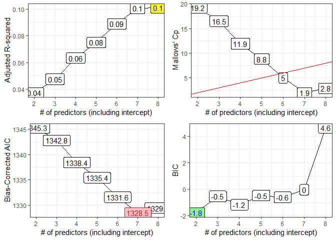
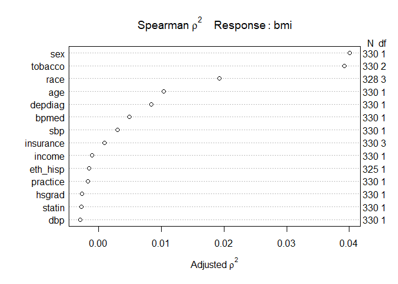

432 Homework 3 Answer Sketch
================
Due 2019-02-22. Version: 2019-02-22

-   [Setup and Data Ingest](#setup-and-data-ingest)
-   [Question 1 (20 points)](#question-1-20-points)
    -   [Preparing the data for `regsubsets`](#preparing-the-data-for-regsubsets)
    -   [Performing an exhaustive search with `regsubsets`](#performing-an-exhaustive-search-with-regsubsets)
    -   [Building our 4 Plots](#building-our-4-plots)
    -   [Selecting a Winner](#selecting-a-winner)
        -   [Model 2 cross-validation](#model-2-cross-validation)
        -   [Model 5 cross-validation](#model-5-cross-validation)
        -   [Model 6 cross-validation](#model-6-cross-validation)
        -   [Model 7 cross-validation](#model-7-cross-validation)
        -   [Model 8 cross-validation](#model-8-cross-validation)
        -   [Summary Table](#summary-table)
    -   [Moving forward with the `sex`, `age`, `bpmed` and `tobacco` model](#moving-forward-with-the-sex-age-bpmed-and-tobacco-model)
-   [Question 2 (10 points)](#question-2-10-points)
    -   [Full `hbp330` data (including Missing Values)](#full-hbp330-data-including-missing-values)
    -   [Complete Cases: `hbp330` data after deleting cases with NAs](#complete-cases-hbp330-data-after-deleting-cases-with-nas)
    -   [Spearman rho-squared plot (applied to full data)](#spearman-rho-squared-plot-applied-to-full-data)
    -   [Spearman rho-squared plot (applied to 325 complete cases)](#spearman-rho-squared-plot-applied-to-325-complete-cases)
-   [Question 3 (20 points)](#question-3-20-points)
-   [Session Information](#session-information)

Setup and Data Ingest
---------------------

``` r
library(skimr); library(broom); library(janitor)
library(leaps); library(modelr); library(tidyverse)

skim_with(numeric = list(hist = NULL), 
          integer = list(hist = NULL))

hbp330 <- read_csv("data/hbp330.csv") %>%
    clean_names()
```

Question 1 (20 points)
======================

> Again, consider the `hbp330` data used in Homeworks 1 and 2. Build your best model for the prediction of body-mass index, considering the following 14 predictors: `practice`, `age`, `race`, `eth_hisp`, `sex`, `insurance`, `income`, `hsgrad`, `tobacco`, `depdiag`, `sbp`, `dbp`, `statin` and `bpmed`. Use an appropriate best subsets procedure to aid in your search, and use a cross-validation strategy to assess and compare potential models. Be sure to provide a written explanation of your conclusions and specify the variables in your final model, in complete sentences.

Preparing the data for `regsubsets`
-----------------------------------

As mentioned, in the answer sketch, we will use a complete cases analysis to deal with missing data.

To get the `regsubsets` function in the `leaps` package to do what we want, we will have to make sure that all of the multi-categorical predictors are expressed as factors (we can do this in a batch by changing all of the character variables to factor variables with `mutate_if`), and we'll need to drop all missing values (we could have first imputed them.)

``` r
hw3q1 <- hbp330 %>%
    mutate( bmi = weight / (height*height) ) %>%
    mutate_if(is.character, as.factor) %>%
    select(bmi, practice, age, race, eth_hisp,
           sex, insurance, income, hsgrad, tobacco,
           depdiag, sbp, dbp, statin, bpmed) %>%
    drop_na 
```

Let's check to be sure everything is either a factor or numeric, and that we now have no missing values.

``` r
skim(hw3q1)
```

    Skim summary statistics
     n obs: 325 
     n variables: 15 

    -- Variable type:factor --------------------------------------------------------------------------------------------
      variable missing complete   n n_unique
       depdiag       0      325 325        2
      eth_hisp       0      325 325        2
     insurance       0      325 325        4
      practice       0      325 325        2
          race       0      325 325        4
           sex       0      325 325        2
       tobacco       0      325 325        3
                               top_counts ordered
                 No: 211, Yes: 114, NA: 0   FALSE
                  No: 261, Yes: 64, NA: 0   FALSE
     Med: 131, Med: 128, Com: 53, Uni: 13   FALSE
                    A: 176, B: 149, NA: 0   FALSE
      Bla: 178, Whi: 131, Asi: 10, Mul: 6   FALSE
                    F: 201, M: 124, NA: 0   FALSE
       nev: 138, for: 115, cur: 72, NA: 0   FALSE

    -- Variable type:numeric -------------------------------------------------------------------------------------------
     variable missing complete   n     mean       sd      p0      p25      p50
          age       0      325 325    55.5     11.53   23       48       57   
          bmi       0      325 325    34.83     8.05   16.73    29.73    33.91
        bpmed       0      325 325     0.66     0.48    0        0        1   
          dbp       0      325 325    74.73    10.24   41       68       74   
       hsgrad       0      325 325    81.92     8.55   57       75       81   
       income       0      325 325 35480.92 15901.56 6800    25600    30600   
          sbp       0      325 325   128.28    17.39   84      116      128   
       statin       0      325 325     0.7      0.46    0        0        1   
          p75      p100
        65        77   
        39.22     64.04
         1         1   
        82       106   
        89       100   
     42600    147400   
       138       194   
         1         1   

Performing an exhaustive search with `regsubsets`
-------------------------------------------------

``` r
q1_preds <- with(hw3q1,
              cbind(practice, age, race, eth_hisp, sex, 
                    insurance, income, hsgrad, tobacco, 
                    depdiag, sbp, dbp, statin, bpmed))

q1_subs <- regsubsets(q1_preds, y = hw3q1$bmi, nvmax = 7)
```

``` r
q1_rs <- summary(q1_subs)
```

The `outmat` section of the summary output has the listing of fitted models that we want. Note that the multi-categorical `race` variables are either in or out, as a group, this way.

``` r
q1_rs$outmat
```

             practice age race eth_hisp sex insurance income hsgrad tobacco
    1  ( 1 ) " "      " " " "  " "      "*" " "       " "    " "    " "    
    2  ( 1 ) " "      "*" " "  " "      "*" " "       " "    " "    " "    
    3  ( 1 ) " "      "*" " "  " "      "*" " "       " "    " "    " "    
    4  ( 1 ) " "      "*" " "  " "      "*" " "       " "    " "    "*"    
    5  ( 1 ) "*"      "*" "*"  " "      "*" " "       " "    " "    " "    
    6  ( 1 ) "*"      "*" "*"  " "      "*" " "       " "    " "    "*"    
    7  ( 1 ) "*"      "*" "*"  " "      "*" " "       " "    " "    "*"    
             depdiag sbp dbp statin bpmed
    1  ( 1 ) " "     " " " " " "    " "  
    2  ( 1 ) " "     " " " " " "    " "  
    3  ( 1 ) " "     " " " " " "    "*"  
    4  ( 1 ) " "     " " " " " "    "*"  
    5  ( 1 ) " "     " " " " " "    "*"  
    6  ( 1 ) " "     " " " " " "    "*"  
    7  ( 1 ) "*"     " " " " " "    "*"  

So, here are our "best subsets" models:

|  Inputs| Predictors Included (in addition to Intercept)                  |
|-------:|-----------------------------------------------------------------|
|       2| `sex`                                                           |
|       3| `sex`, `age`                                                    |
|       4| `sex`, `age`, `bpmed`                                           |
|       5| `sex`, `age`, `bpmed`, `tobacco`                                |
|       6| `sex`, `age`, `bpmed`, `practice`, `race`                       |
|       7| `sex`, `age`, `bpmed`, `practice`, `race`, `tobacco`            |
|       8| `sex`, `age`, `bpmed`, `practice`, `race`, `tobacco`, `depdiag` |

``` r
round(q1_rs$adjr2, 4)
```

    [1] 0.0373 0.0476 0.0634 0.0750 0.0889 0.1006 0.1008

``` r
round(q1_rs$cp, 1)
```

    [1] 19.2 16.5 11.9  8.8  5.0  1.9  2.8

``` r
round(q1_rs$bic, 1)
```

    [1] -1.8 -0.5 -1.2 -0.5 -0.6  0.0  4.6

``` r
# since n for hw3q1 is 325, and we are looking at 2-8 inputs
q1_rs$aic.c <- 325*log(q1_rs$rss / 325) + 2*(2:8) +
               (2 * (2:8) * ((2:8)+1) / (325 - (2:8) - 1))

round(q1_rs$aic.c, 1)
```

    [1] 1345.3 1342.8 1338.4 1335.4 1331.6 1328.5 1329.4

``` r
best_mods_1 <- tibble(
    k = 2:8,
    r2 = q1_rs$rsq,
    adjr2 = q1_rs$adjr2,
    cp = q1_rs$cp,
    aic.c = q1_rs$aic.c,
    bic = q1_rs$bic
)

best_mods <- cbind(best_mods_1, q1_rs$which)

best_mods
```

      k         r2      adjr2        cp    aic.c         bic (Intercept)
    1 2 0.04024985 0.03727849 19.201108 1345.312 -1.78409378        TRUE
    2 3 0.05352477 0.04764604 16.495568 1342.823 -0.52693024        TRUE
    3 4 0.07206846 0.06339620 11.922415 1338.442 -1.17382911        TRUE
    4 5 0.08646901 0.07504987  8.817876 1335.422 -0.47321713        TRUE
    5 6 0.10295113 0.08889080  4.975487 1331.581 -0.60665159        TRUE
    6 7 0.11721042 0.10055401  1.921019 1328.462 -0.03045461        TRUE
    7 8 0.12027149 0.10084531  2.835965 1329.436  4.62447441        TRUE
      practice   age  race eth_hisp  sex insurance income hsgrad tobacco
    1    FALSE FALSE FALSE    FALSE TRUE     FALSE  FALSE  FALSE   FALSE
    2    FALSE  TRUE FALSE    FALSE TRUE     FALSE  FALSE  FALSE   FALSE
    3    FALSE  TRUE FALSE    FALSE TRUE     FALSE  FALSE  FALSE   FALSE
    4    FALSE  TRUE FALSE    FALSE TRUE     FALSE  FALSE  FALSE    TRUE
    5     TRUE  TRUE  TRUE    FALSE TRUE     FALSE  FALSE  FALSE   FALSE
    6     TRUE  TRUE  TRUE    FALSE TRUE     FALSE  FALSE  FALSE    TRUE
    7     TRUE  TRUE  TRUE    FALSE TRUE     FALSE  FALSE  FALSE    TRUE
      depdiag   sbp   dbp statin bpmed
    1   FALSE FALSE FALSE  FALSE FALSE
    2   FALSE FALSE FALSE  FALSE FALSE
    3   FALSE FALSE FALSE  FALSE  TRUE
    4   FALSE FALSE FALSE  FALSE  TRUE
    5   FALSE FALSE FALSE  FALSE  TRUE
    6   FALSE FALSE FALSE  FALSE  TRUE
    7    TRUE FALSE FALSE  FALSE  TRUE

So, now, which of these models shows the best results?

-   By Adjusted R<sup>2</sup>
-   By C\_p
-   By corrected AIC
-   By BIC

Building our 4 Plots
--------------------

``` r
p1 <- ggplot(best_mods, aes(x = k, y = adjr2,
                            label = round(adjr2,2))) +
    geom_line() +
    geom_label() +
    geom_label(data = subset(best_mods,
                             adjr2 == max(adjr2)),
               aes(x = k, y = adjr2, label = round(adjr2,2)),
               fill = "yellow", col = "blue") +
    theme_bw() +
    scale_x_continuous(breaks = 2:9) +
    labs(x = "# of predictors (including intercept)",
         y = "Adjusted R-squared")

p2 <- ggplot(best_mods, aes(x = k, y = cp,
                            label = round(cp,1))) +
    geom_line() +
    geom_label() +
    geom_abline(intercept = 0, slope = 1,
                col = "red") +
    theme_bw() +
    scale_x_continuous(breaks = 2:9) +
    labs(x = "# of predictors (including intercept)",
         y = "Mallows' Cp")

p3 <- ggplot(best_mods, aes(x = k, y = aic.c,
                             label = round(aic.c,1))) +
    geom_line() +
    geom_label() +
    geom_label(data = subset(best_mods, aic.c == min(aic.c)),
               aes(x = k, y = aic.c), fill = "pink", 
               col = "red") +
    theme_bw() +
    scale_x_continuous(breaks = 2:9) +
    labs(x = "# of predictors (including intercept)",
         y = "Bias-Corrected AIC")

p4 <- ggplot(best_mods, aes(x = k, y = bic,
                            label = round(bic,1))) +
    geom_line() +
    geom_label() +
    geom_label(data = subset(best_mods, bic == min(bic)),
               aes(x = k, y = bic),
               fill = "lightgreen", col = "blue") +
    theme_bw() +
    scale_x_continuous(breaks = 2:9) +
    labs(x = "# of predictors (including intercept)",
         y = "BIC")

gridExtra::grid.arrange(p1, p2, p3, p4, nrow = 2)
```



Selecting a Winner
------------------

The models we'll consider are:

|  Inputs| Predictors Included                         | Reason                               |
|-------:|---------------------------------------------|--------------------------------------|
|       2| Intercept, `sex`                            | lowest BIC                           |
|       5| Add `age`, `bpmed`, `tobacco` to 2          | (sort of) suggested by C<sub>p</sub> |
|       6| Add `age`, `bpmed`, `practice`, `race` to 2 | suggested by C<sub>p</sub>           |
|       7| Add `tobacco` to 6                          | lowest AIC(corr.)                    |
|       8| Add `depdiag` to 7                          | highest adj. R<sup>2</sup>           |

We'll fit each of these models (and, in fact, the 5 predictor one, too) in turn, and then perform a 5-fold cross validation for each, then compare results. In each case, we'll calculate the root mean squared error of the predictions, and the mean absolute prediction error across the complete samples.

### Model 2 cross-validation

There's not much point to this - though BIC likes it, we're not likely to be fond of a model that uses only a single binary predictor.

``` r
set.seed(4320142)

q1m2 <- hw3q1 %>%
  crossv_kfold(k = 5) %>%
  mutate(model = map(train, ~ lm(bmi ~ sex, data = .)))

q1m2_pred <- q1m2 %>%
  unnest(map2(model, test, ~ augment(.x, newdata = .y)))

res2 <- q1m2_pred %>%
  summarise(Model = "2",
            RMSE = sqrt(mean((bmi - .fitted) ^2)),
            MAE = mean(abs(bmi - .fitted)))
```

**Note**: Sometimes you'll get an error here if R thinks you want a different version of summarize than the one in `dplyr`. A way around this is to use `summarise` rather than `summarize`.

### Model 5 cross-validation

``` r
set.seed(4320145)

q1m5 <- hw3q1 %>%
  crossv_kfold(k = 5) %>%
  mutate(model = map(train, 
                     ~ lm(bmi ~ sex + age + bpmed + tobacco, data = .)))

q1m5_pred <- q1m5 %>%
  unnest(map2(model, test, ~ augment(.x, newdata = .y)))

res5 <- q1m5_pred %>%
  summarize(Model = "5",
            RMSE = sqrt(mean((bmi - .fitted) ^2)),
            MAE = mean(abs(bmi - .fitted)))
```

### Model 6 cross-validation

``` r
set.seed(4320146)

q1m6 <- hw3q1 %>%
  crossv_kfold(k = 5) %>%
  mutate(model = map(train, 
                     ~ lm(bmi ~ sex + age + bpmed + practice + race, data = .)))

q1m6_pred <- q1m6 %>%
  unnest(map2(model, test, ~ augment(.x, newdata = .y)))

res6 <- q1m6_pred %>%
  summarize(Model = "6",
            RMSE = sqrt(mean((bmi - .fitted) ^2)),
            MAE = mean(abs(bmi - .fitted)))
```

### Model 7 cross-validation

``` r
set.seed(4320147)

q1m7 <- hw3q1 %>%
  crossv_kfold(k = 5) %>%
  mutate(model = map(train, 
                     ~ lm(bmi ~ sex + age + bpmed +
                            practice + race + tobacco, 
                          data = .)))

q1m7_pred <- q1m7 %>%
  unnest(map2(model, test, ~ augment(.x, newdata = .y)))

res7 <- q1m7_pred %>%
  summarize(Model = "7",
            RMSE = sqrt(mean((bmi - .fitted) ^2)),
            MAE = mean(abs(bmi - .fitted)))
```

### Model 8 cross-validation

``` r
set.seed(4320148)

q1m8 <- hw3q1 %>%
  crossv_kfold(k = 5) %>%
  mutate(model = map(train, 
                     ~ lm(bmi ~ sex + age + bpmed +
                            practice + race + tobacco +
                              depdiag, data = .)))

q1m8_pred <- q1m8 %>%
  unnest(map2(model, test, ~ augment(.x, newdata = .y)))

res8 <- q1m8_pred %>%
  summarize(Model = "8",
            RMSE = sqrt(mean((bmi - .fitted) ^2)),
            MAE = mean(abs(bmi - .fitted)))
```

### Summary Table

``` r
bind_rows(res2, res5, res6, res7, res8) 
```

    # A tibble: 5 x 3
      Model  RMSE   MAE
      <chr> <dbl> <dbl>
    1 2      7.99  6.17
    2 5      7.64  5.90
    3 6      7.78  5.96
    4 7      7.73  5.96
    5 8      7.66  5.90

Model 5 looks best by RMSE, and model 8 looks best by MAE. So we need to make a choice. I will pick the 5-input model, mainly because it has fewer predictors.

Moving forward with the `sex`, `age`, `bpmed` and `tobacco` model
-----------------------------------------------------------------

Refitting this model to the complete case sample of people without missing values on the variables we decided to use at the beginning, we have the following summary results.

``` r
summary(lm(bmi ~ sex + age + bpmed + tobacco, data = hw3q1))
```


    Call:
    lm(formula = bmi ~ sex + age + bpmed + tobacco, data = hw3q1)

    Residuals:
         Min       1Q   Median       3Q      Max 
    -18.6230  -5.1338  -0.8431   4.2077  27.4879 

    Coefficients:
                  Estimate Std. Error t value Pr(>|t|)    
    (Intercept)   38.57464    2.25912  17.075  < 2e-16 ***
    sexM          -3.52607    0.88621  -3.979 8.58e-05 ***
    age           -0.12415    0.03852  -3.223 0.001398 ** 
    bpmed          2.34229    0.91966   2.547 0.011338 *  
    tobaccoformer  4.50459    1.16070   3.881 0.000126 ***
    tobacconever   3.20177    1.11980   2.859 0.004526 ** 
    ---
    Signif. codes:  0 '***' 0.001 '**' 0.01 '*' 0.05 '.' 0.1 ' ' 1

    Residual standard error: 7.633 on 319 degrees of freedom
    Multiple R-squared:  0.1146,    Adjusted R-squared:  0.1007 
    F-statistic: 8.256 on 5 and 319 DF,  p-value: 2.377e-07

Question 2 (10 points)
======================

> Refer to the modeling task you accomplished in Question 1. Now, your job is to fit a Spearman rho-squared plot to identify the candidate variables (out of the 14 you studied) on which you might most reasonably try to address non-linearity in a model predicting body-mass index, now making use of as much of the data set that missing data allow (without imputation.) Show the plot, and provide a written explanation of your conclusions about it, and specify the variables that are most appealing for non-linear augmentations, all in complete sentences. Which variables are most appealing candidates to add non-linear evaluations to a linear fit to the complete set of 14 predictors, and why?

Full `hbp330` data (including Missing Values)
---------------------------------------------

``` r
hbp330_full <- hbp330 %>%
    mutate( bmi = weight / (height*height)) %>%
    select(subject, bmi, practice, age, race, eth_hisp, sex, 
                    insurance, income, hsgrad, tobacco, 
                    depdiag, sbp, dbp, statin, bpmed)

hbp330_full %>% skim(-subject)
```

    Skim summary statistics
     n obs: 330 
     n variables: 16 

    -- Variable type:character -----------------------------------------------------------------------------------------
      variable missing complete   n min max empty n_unique
       depdiag       0      330 330   2   3     0        2
      eth_hisp       5      325 330   2   3     0        2
     insurance       0      330 330   8  10     0        4
      practice       0      330 330   1   1     0        2
          race       2      328 330   5  12     0        4
           sex       0      330 330   1   1     0        2
       tobacco       0      330 330   5   7     0        3

    -- Variable type:numeric -------------------------------------------------------------------------------------------
     variable missing complete   n     mean       sd      p0      p25      p50
          age       0      330 330    55.35    11.53   23       48       57   
          bmi       0      330 330    34.83     8.03   16.73    29.73    33.92
        bpmed       0      330 330     0.66     0.48    0        0        1   
          dbp       0      330 330    74.75    10.2    41       68       74   
       hsgrad       0      330 330    81.93     8.54   57       75       81   
       income       0      330 330 35342.73 15888.27 6800    25600    30600   
          sbp       0      330 330   128.37    17.3    84      116      128.5 
       statin       0      330 330     0.71     0.46    0        0        1   
          p75      p100
        65        77   
        39.18     64.04
         1         1   
        82       106   
        89       100   
     42475    147400   
       138       194   
         1         1   

There are 5 missing `eth_hisp` values and 2 missing `race` values.

Complete Cases: `hbp330` data after deleting cases with NAs
-----------------------------------------------------------

``` r
hbp330_noNA <- hbp330 %>%
    mutate( bmi = weight / (height*height)) %>%
    select(subject, bmi, practice, age, race, eth_hisp, sex, 
                    insurance, income, hsgrad, tobacco, 
                    depdiag, sbp, dbp, statin, bpmed) %>%
    drop_na

dim(hbp330_noNA)
```

    [1] 325  16

Again, we lose a total of five observations (dropping from 330 to 325 subjects) by dropping missing values.

Spearman rho-squared plot (applied to full data)
------------------------------------------------

You might have chosen to include all observations, and simply allow the Spearman *ρ*<sup>2</sup> plot to reduce the sample size for the specific variables (`race` and `eth_hisp`) that had missing values. That produces this result.

``` r
plot(Hmisc::spearman2(bmi ~ practice + age + race + 
                          eth_hisp + sex + insurance + 
                          income + hsgrad + tobacco +
                          depdiag + sbp + dbp + statin + 
                          bpmed, data = hbp330_full))
```



Spearman rho-squared plot (applied to 325 complete cases)
---------------------------------------------------------

Or, you might have chosen to include only the 325 complete cases, and so the Spearman *ρ*<sup>2</sup> plot would address only those subjects without missing `eth_hisp` or `race`. That produces this result.

``` r
plot(Hmisc::spearman2(bmi ~ practice + age + race + 
                          eth_hisp + sex + insurance + 
                          income + hsgrad + tobacco +
                          depdiag + sbp + dbp + statin + 
                          bpmed, data = hbp330_noNA))
```


In either case, the variables which pack the largest "potential predictive punch" in this setting are, in order, (1) `sex` and (2) `tobacco`. Certainly, those are the most appealing variables for which we should consider non-linear augmentations. Since these are categorical variables, the inclusion of interaction terms seems appealing. We might, for instance, include the `sex`-`tobacco` interaction or an interaction of `sex` or `tobacco` or both with the next two highest variables on the list: `race` and `age`.

Question 3 (20 points)
======================

> First, in 2-4 complete English sentences, please specify, using your own words and complete English sentences, the most useful and relevant piece of advice you took away from reading Jeff Leek's *How To Be A Modern Scientist*.

> Second, in an essay of 4-8 additional sentences, describe why this particular piece of advice was meaningful or useful for you, personally, and how it will affect the way you move forward.

We don't write sketches for essay questions. We hope to share a few of the more interesting responses with you after they've been graded.

Session Information
===================

``` r
sessioninfo::session_info()
```

    - Session info ----------------------------------------------------------
     setting  value                       
     version  R version 3.5.2 (2018-12-20)
     os       Windows 10 x64              
     system   x86_64, mingw32             
     ui       RTerm                       
     language (EN)                        
     collate  English_United States.1252  
     ctype    English_United States.1252  
     tz       America/New_York            
     date     2019-02-22                  

    - Packages --------------------------------------------------------------
     package      * version    date       lib source                          
     acepack        1.4.1      2016-10-29 [1] CRAN (R 3.5.0)                  
     assertthat     0.2.0      2017-04-11 [1] CRAN (R 3.5.0)                  
     backports      1.1.3      2018-12-14 [1] CRAN (R 3.5.2)                  
     base64enc      0.1-3      2015-07-28 [1] CRAN (R 3.5.0)                  
     bindr          0.1.1      2018-03-13 [1] CRAN (R 3.5.0)                  
     bindrcpp     * 0.2.2      2018-03-29 [1] CRAN (R 3.5.0)                  
     broom        * 0.5.1      2018-12-05 [1] CRAN (R 3.5.2)                  
     cellranger     1.1.0      2016-07-27 [1] CRAN (R 3.5.0)                  
     checkmate      1.9.1      2019-01-15 [1] CRAN (R 3.5.2)                  
     cli            1.0.1      2018-09-25 [1] CRAN (R 3.5.1)                  
     cluster        2.0.7-1    2018-04-13 [2] CRAN (R 3.5.2)                  
     colorspace     1.4-0      2019-01-13 [1] CRAN (R 3.5.2)                  
     crayon         1.3.4      2017-09-16 [1] CRAN (R 3.5.0)                  
     data.table     1.12.0     2019-01-13 [1] CRAN (R 3.5.2)                  
     digest         0.6.18     2018-10-10 [1] CRAN (R 3.5.1)                  
     dplyr        * 0.7.8      2018-11-10 [1] CRAN (R 3.5.1)                  
     evaluate       0.12       2018-10-09 [1] CRAN (R 3.5.1)                  
     fansi          0.4.0      2018-10-05 [1] CRAN (R 3.5.1)                  
     forcats      * 0.3.0      2018-02-19 [1] CRAN (R 3.5.0)                  
     foreign        0.8-71     2018-07-20 [1] CRAN (R 3.5.2)                  
     Formula        1.2-3      2018-05-03 [1] CRAN (R 3.5.0)                  
     generics       0.0.2      2018-11-29 [1] CRAN (R 3.5.1)                  
     ggplot2      * 3.1.0      2018-10-25 [1] CRAN (R 3.5.1)                  
     glue           1.3.0      2018-07-17 [1] CRAN (R 3.5.2)                  
     gridExtra      2.3        2017-09-09 [1] CRAN (R 3.5.2)                  
     gtable         0.2.0      2016-02-26 [1] CRAN (R 3.5.0)                  
     haven          2.0.0.9000 2018-12-11 [1] Github (tidyverse/haven@f0dc4e5)
     Hmisc          4.2-0      2019-01-26 [1] CRAN (R 3.5.2)                  
     hms            0.4.2      2018-03-10 [1] CRAN (R 3.5.0)                  
     htmlTable      1.13.1     2019-01-07 [1] CRAN (R 3.5.2)                  
     htmltools      0.3.6      2017-04-28 [1] CRAN (R 3.5.0)                  
     htmlwidgets    1.3        2018-09-30 [1] CRAN (R 3.5.1)                  
     httr           1.4.0      2018-12-11 [1] CRAN (R 3.5.2)                  
     janitor      * 1.1.1      2018-07-31 [1] CRAN (R 3.5.1)                  
     jsonlite       1.6        2018-12-07 [1] CRAN (R 3.5.2)                  
     knitr          1.21       2018-12-10 [1] CRAN (R 3.5.2)                  
     labeling       0.3        2014-08-23 [1] CRAN (R 3.5.0)                  
     lattice        0.20-38    2018-11-04 [1] CRAN (R 3.5.2)                  
     latticeExtra   0.6-28     2016-02-09 [1] CRAN (R 3.5.0)                  
     lazyeval       0.2.1      2017-10-29 [1] CRAN (R 3.5.0)                  
     leaps        * 3.0        2017-01-10 [1] CRAN (R 3.5.2)                  
     lubridate      1.7.4      2018-04-11 [1] CRAN (R 3.5.0)                  
     magrittr       1.5        2014-11-22 [1] CRAN (R 3.5.2)                  
     Matrix         1.2-15     2018-11-01 [2] CRAN (R 3.5.2)                  
     modelr       * 0.1.2      2018-05-11 [1] CRAN (R 3.5.0)                  
     munsell        0.5.0      2018-06-12 [1] CRAN (R 3.5.0)                  
     nlme           3.1-137    2018-04-07 [2] CRAN (R 3.5.2)                  
     nnet           7.3-12     2016-02-02 [1] CRAN (R 3.5.2)                  
     pillar         1.3.1      2018-12-15 [1] CRAN (R 3.5.2)                  
     pkgconfig      2.0.2      2018-08-16 [1] CRAN (R 3.5.1)                  
     plyr           1.8.4      2016-06-08 [1] CRAN (R 3.5.0)                  
     purrr        * 0.3.0      2019-01-27 [1] CRAN (R 3.5.2)                  
     R6             2.3.0      2018-10-04 [1] CRAN (R 3.5.1)                  
     RColorBrewer   1.1-2      2014-12-07 [1] CRAN (R 3.5.0)                  
     Rcpp           1.0.0      2018-11-07 [1] CRAN (R 3.5.1)                  
     readr        * 1.3.1      2018-12-21 [1] CRAN (R 3.5.2)                  
     readxl         1.3.0      2019-02-15 [1] CRAN (R 3.5.2)                  
     rlang          0.3.1      2019-01-08 [1] CRAN (R 3.5.2)                  
     rmarkdown      1.11       2018-12-08 [1] CRAN (R 3.5.2)                  
     rpart          4.1-13     2018-02-23 [2] CRAN (R 3.5.2)                  
     rstudioapi     0.9.0      2019-01-09 [1] CRAN (R 3.5.2)                  
     rvest          0.3.2      2016-06-17 [1] CRAN (R 3.5.0)                  
     scales         1.0.0      2018-08-09 [1] CRAN (R 3.5.1)                  
     sessioninfo    1.1.1      2018-11-05 [1] CRAN (R 3.5.1)                  
     skimr        * 1.0.4      2019-01-13 [1] CRAN (R 3.5.2)                  
     snakecase      0.9.2      2018-08-14 [1] CRAN (R 3.5.1)                  
     stringi        1.2.4      2018-07-20 [1] CRAN (R 3.5.1)                  
     stringr      * 1.3.1      2018-05-10 [1] CRAN (R 3.5.0)                  
     survival       2.43-3     2018-11-26 [1] CRAN (R 3.5.2)                  
     tibble       * 2.0.1      2019-01-12 [1] CRAN (R 3.5.2)                  
     tidyr        * 0.8.2      2018-10-28 [1] CRAN (R 3.5.1)                  
     tidyselect     0.2.5      2018-10-11 [1] CRAN (R 3.5.1)                  
     tidyverse    * 1.2.1      2017-11-14 [1] CRAN (R 3.5.2)                  
     utf8           1.1.4      2018-05-24 [1] CRAN (R 3.5.0)                  
     withr          2.1.2      2018-03-15 [1] CRAN (R 3.5.0)                  
     xfun           0.4        2018-10-23 [1] CRAN (R 3.5.1)                  
     xml2           1.2.0      2018-01-24 [1] CRAN (R 3.5.0)                  
     yaml           2.2.0      2018-07-25 [1] CRAN (R 3.5.1)                  

    [1] C:/Users/Thomas/Documents/R/win-library/3.5
    [2] C:/Program Files/R/R-3.5.2/library
