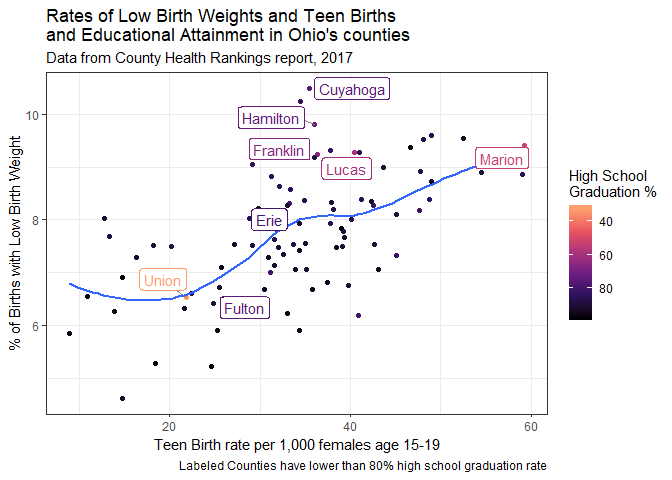

432 Homework 4 Answer Sketch and Grading Rubric
================
Due 2019-03-22. Version: 2019-03-15

  - [Setup and Data Ingest](#setup-and-data-ingest)
  - [Question 1 (15 points)](#question-1-15-points)
      - [Answer for Question 1](#answer-for-question-1)
      - [Grading Rubric: Question 1](#grading-rubric-question-1)
  - [Question 2 (15 points)](#question-2-15-points)
      - [Answer 2](#answer-2)
      - [Grading Rubric: Question 2](#grading-rubric-question-2)
  - [Question 3 (10 points)](#question-3-10-points)
      - [Answer 3](#answer-3)
      - [Grading Rubric: Question 3](#grading-rubric-question-3)
  - [Question 4 (10 points)](#question-4-10-points)
      - [Answer 4](#answer-4)
      - [Grading Rubric: Question 4](#grading-rubric-question-4)
      - [Session Information](#session-information)

## Setup and Data Ingest

``` r
library(ggrepel)
library(viridis)
library(broom); library(janitor); library(tidyverse)

ohc <- read_csv("oh_counties_2017.csv") %>%
    clean_names()
```

The `oh_counties_2017.csv` data set I have provided describes a series
of variables, pulled from the data for the 88 counties of the the State
of Ohio from the [County Health
Rankings](http://www.countyhealthrankings.org/rankings/data/oh) report
for 2017.

  - You may also be interested in looking at the details of the [2017
    Ohio Summary report
    (pdf)](http://www.countyhealthrankings.org/sites/default/files/state/downloads/CHR2017_OH.pdf),
    or at the [Excel data
    file](http://www.countyhealthrankings.org/sites/default/files/state/downloads/2017%20County%20Health%20Rankings%20Ohio%20Data%20-%20v2.xls)
    from which I created the `oh_counties_2017.csv` file.
  - Note that the 2018 data and report were released recently, but we
    will concentrate in this assignment on the 2017 results.

The available variables are listed below. Each variable describes data
at the **COUNTY**
level.

|        Variable        | Description                                                                                                                        |
| :--------------------: | ---------------------------------------------------------------------------------------------------------------------------------- |
|          fips          | Federal Information Processing Standard code                                                                                       |
|         county         | name of County                                                                                                                     |
|   years\_lost\_rate    | age-adjusted years of potential life lost rate (per 100,000 population)                                                            |
|     sroh\_fairpoor     | % of adults reporting fair or poor health (via BRFSS)                                                                              |
|       phys\_days       | mean number of reported physically unhealthy days per month                                                                        |
|       ment\_days       | mean number of reported mentally unhealthy days per mo                                                                             |
|        lbw\_pct        | % of births with low birth weight (\< 2500 grams)                                                                                  |
|      smoker\_pct       | % of adults that report currently smoking                                                                                          |
|       obese\_pct       | % of adults that report body mass index of 30 or higher                                                                            |
|       food\_env        | indicator of access to healthy foods, in points (0 is worst, 10 is best)                                                           |
|     inactive\_pct      | % of adults that report no leisure-time physical activity                                                                          |
|      exer\_access      | % of the population with access to places for physical activity                                                                    |
|       exc\_drink       | % of adults that report excessive drinking                                                                                         |
|       alc\_drive       | % of driving deaths with alcohol involvement                                                                                       |
|       sti\_rate        | Chlamydia cases / Population x 100,000                                                                                             |
|      teen\_births      | Teen births / females ages 15-19 x 1,000                                                                                           |
|       uninsured        | % of people under age 65 without insurance                                                                                         |
|       pcp\_ratio       | Population to Primary Care Physicians ratio                                                                                        |
|       prev\_hosp       | Discharges for Ambulatory Care Sensitive Conditions/Medicare Enrollees x 1,000                                                     |
|        hsgrads         | High School graduation rate                                                                                                        |
|       unemployed       | % of population age 16+ who are unemployed and looking for work                                                                    |
|       poor\_kids       | % of children (under age 18) living in poverty                                                                                     |
|     income\_ratio      | Ratio of household income at the 80th percentile to income at the 20th percentile                                                  |
|      associations      | \# of social associations / population x 10,000                                                                                    |
|         pm2.5          | Average daily amount of fine particulate matter in micrograms per cubic meter                                                      |
|        h2oviol         | Presence of a water violation: Yes or No                                                                                           |
|      sev\_housing      | % of households with at least 1 of 4 housing problems: overcrowding, high housing costs, or lack of kitchen or plumbing facilities |
|      drive\_alone      | % of workers who drive alone to work                                                                                               |
|   age.adj.mortality    | premature age-adjusted mortality                                                                                                   |
|        dm\_prev        | % with a diabetes diagnosis                                                                                                        |
|  freq\_phys\_distress  | % in frequent physical distress                                                                                                    |
| freq\_mental\_distress | % in frequent mental distress                                                                                                      |
|     food\_insecure     | % who are food insecure                                                                                                            |
|     insuff\_sleep      | % who get insufficient sleep                                                                                                       |
|     health\_costs      | estimated mean health care costs                                                                                                   |
|     median\_income     | estimated median income                                                                                                            |
|       population       | population size                                                                                                                    |
|       age65plus        | % of population who are 65 and over                                                                                                |
|       african-am       | % of population who are African-American                                                                                           |
|        hispanic        | % of population who are of Hispanic/Latino ethnicity                                                                               |
|         white          | % of population who are White                                                                                                      |
|         female         | % of population who are Female                                                                                                     |
|         rural          | % of people in the county who live in rural areas                                                                                  |

# Question 1 (15 points)

Create a visualization (using R) based on some part of the
`oh_counties_2017.csv` data set, and share it (the visualization and the
R code you used to build it) with us. The visualization should be of a
professional quality, describe information from at least three different
variables listed above, include proper labels and a title, as well as a
caption of no more than 50 words that highlights the key result.
Although you may fit a model to help show patterns, your primary task is
to show **the data** in a meaningful way, rather than to simply
highlight the results of a model.

  - You are welcome to find useful tools for visualizing data in R that
    we have yet to see in the slides in class.
  - We will grade Question 1 strictly based on the quality of the
    visualization, its title and caption, in terms of being attractive,
    well-labeled and useful for representing the County Health Rankings
    data for Ohio, and how well it adheres to general principles for
    good visualizations we’ve seen in 431 and 432.

## Answer for Question 1

There are, literally, thousands of appropriate options here, so it’s
difficult to write a sketch. Of course, that statement is true for all
of these questions.

What Dr. Love assumed most people would do is some sort of labeled
scatterplot. Here’s an example.

``` r
ggplot(ohc, aes(x = teen_births, y = lbw_pct, 
                col= hsgrads))  +
    geom_point() +
    geom_smooth(method = "loess", se = FALSE) +
    geom_label_repel(aes(
        label=ifelse(hsgrads<80, as.character(county),'')),
        segment.color = 'grey50') +
    theme_bw() +
    scale_color_viridis_c(end = 0.8, option = "magma",
        (name="High School \nGraduation %"), 
        trans = "reverse") +
    labs(
        title = "Rates of Low Birth Weights and Teen Births\nand Educational Attainment in Ohio's counties",
        subtitle = "Data from County Health Rankings report, 2017",
        caption="Labeled Counties have lower than 80% high school graduation rate",
        y = "% of Births with Low Birth Weight", 
        x = "Teen Birth rate per 1,000 females age 15-19")
```

<!-- -->

Some people built maps, as well. That’s great, but it’s hard to show
more than one variable at a time on a map of Ohio’s counties. Dr. Love
will share some of the plots we found to be most effective in class.

## Grading Rubric: Question 1

  - Award 12 points for a good effort and 13-15 points for an especially
    strong effort (one of the top 5-8 visualizations we saw).
  - Anything that seems way off the mark should get 10 or less, and
    should be drawn to my attention, as should the graphs that get 13-15
    points.
  - Take off 1 point from the total if you find one or two typographical
    or syntax/grammar errors in this response.
  - Take off 2 points from the total if you find three or more such
    errors.

I expect most people to score 11-13 points on this question.

# Question 2 (15 points)

Write an essay (between 100 and 200 words) describing the creation and
meaning of the visualization you created in Question 1, providing us
with the context we need to understand why this is a useful
visualization. In your short description, be sure to address:

  - How does this visualization help its audience understand the data
    better?
  - Why is this particular visualization effective, and what are the
    design features it uses that we can learn from to help us make more
    effective visualizations?

## Answer 2

We don’t write sketches for essay questions, but the takeaway from the
labeled scatterplot provided above should draw attention to:

  - the general pattern (% of low birth weight births generally rises
    with the teen birth rate) displayed,
  - other features of the data (outlying counties at the high end also
    generally have lower educational attainment),
  - plus identify the outliers (Union County, in terms of HS Graduation
    Rate, but also Cuyahoga in terms of low birth weight and Marion, in
    terms of high teen birth rate.)

## Grading Rubric: Question 2

  - Award 13 points for any essay that is within the word limit (or
    close) and answers the two questions reasonably well.
  - Award 14-15 points for an essay that does a really nice job.
  - Award 10 or fewer points to anything that doesn’t address both
    questions, or is way off the mark.
  - Take off 1 point from the total if you find one or two typographical
    or syntax/grammar errors in this response.
  - Take off 2 points from the total if you find three or more such
    errors.

Almost all of the essays will thus score 12-14 points on this question,
I’d guess.

# Question 3 (10 points)

Create a linear regression model to predict `obese_pct` as a function of
`food_env` adjusting for `median_income`, and treating all three
variables as quantitative, using all counties with complete data on
those three variables. Specify and then carefully interpret the
estimated coefficient of `food_env` and a 90% confidence interval around
that estimate in context using nothing but complete English sentences. A
model using main effects only, entered as linear predictors, will be
sufficient.

## Answer 3

The model we had in mind was

``` r
model3 <- lm(obese_pct ~ food_env + median_income, data = ohc)

tidy(model3, conf.int = TRUE, conf.level = 0.90)
```

    # A tibble: 3 x 7
      term           estimate std.error statistic  p.value   conf.low conf.high
      <chr>             <dbl>     <dbl>     <dbl>    <dbl>      <dbl>     <dbl>
    1 (Intercept)   32.8      3.17          10.4  1.00e-16  27.5        3.81e+1
    2 food_env       1.14     0.547          2.09 3.99e- 2   0.232      2.05e+0
    3 median_inco~  -0.000166 0.0000363     -4.57 1.66e- 5  -0.000226  -1.05e-4

  - The value of the estimated effect of a change of 1 point in
    `food_env` is an increase of 1.14 percentage points in `obese_pct`,
    with a 90% CI of (0.23, 2.05), assuming `median_income` is
    unchanged.

## Grading Rubric: Question 3

  - Estimating the result correctly is worth 3 points.
  - The other seven points are awarded if the student has an excellent
    description of the effect size. That description should:
      - describe a comparison between two *counties*, with the *same
        median income*, who differ by 1 *point* in `food_env` and come
        to a conclusion about the *size* and the *direction* of the
        effect on `obese_pct`, while using *appropriate units* for
        `food_env` and `obese_pct` and indicating the *statistical
        significance* of the result at the *10% significance level* (or
        *90% confidence level*) with reference to the confidence
        interval.
      - the seven key elements are:
        1.  this model describes counties, not
            subjects/individuals/whatever
        2.  holding the same median income
        3.  comparison of two counties with differing food environments
            with the correct units for the food environment measure
        4.  description of effect on an outcome with the correct units
            for the outcome
        5.  size of effect specified to match their model
        6.  direction of effect specified to match their model
        7.  significance of effect and level of confidence/significance
  - Showing the effect graphically is a nice, but ungraded, touch.

# Question 4 (10 points)

Create a logistic regression model to predict the presence of a water
violation (as contained in `h2oviol`) on the basis of `sev_housing` and
`pm2.5`. Specify and then carefully interpret the estimated coefficient
of `sev_housing` and a 90% confidence interval around that estimate in
context using nothing but complete English sentences. A model using main
effects only, entered as linear predictors, will be sufficient.

## Answer 4

The model we had in mind
was

``` r
model4 <- glm(h2oviol == "Yes" ~ sev_housing + pm2_5, data = ohc, family = binomial())

tidy(model4, conf.int = TRUE, conf.level = 0.90, exponentiate = TRUE)
```

    # A tibble: 3 x 7
      term        estimate std.error statistic p.value    conf.low conf.high
      <chr>          <dbl>     <dbl>     <dbl>   <dbl>       <dbl>     <dbl>
    1 (Intercept)  0.00303    5.36      -1.08    0.280 0.000000311     17.5 
    2 sev_housing  1.03       0.0869     0.300   0.764 0.889            1.19
    3 pm2_5        1.60       0.467      1.01    0.313 0.752            3.55

  - The value of the estimated effect of a change of 1 percentage point
    in `sev_housing` is an increase by a factor of 1.026 in the odds of
    a water violation, with a 90% CI of (0.89, 1.19), assuming `pm2_5`
    is unchanged.

## Grading Rubric: Question 4

  - Estimating the result correctly is worth 3 points.
  - The other seven points are awarded if the student has an excellent
    description of the effect size. That description should:
      - describe a comparison between two *counties*, with the *same
        pm2\_5*, who differ by 1 *percentage point* in `sev_housing` and
        come to a conclusion about the *size* and the *direction* of the
        effect on `h2oviol` in terms of an odds ratio, while using
        *appropriate units* for all variables, referring to odds
        changes, rather than changes in risk or probability and
        indicating the *statistical significance* of the result at the
        *10% significance level* (or *90% confidence level*) with
        reference to the confidence interval.
      - the seven key elements are:
        1.  this model describes counties, not
            subjects/individuals/whatever
        2.  holding the same pm2.5 or pm2\_5 (depending on whether they
            cleaned the names)
        3.  comparison of two counties with differing percentages
            meeting the `sev_housing` standard
        4.  description of effect on the `h2oviol` odds
        5.  size of effect specified to match their model
        6.  direction of effect specified to match their model (which
            should be about the odds of having a violation)
        7.  (lack of) significance of effect and level of
            confidence/significance
  - Showing the effect graphically is a nice, but ungraded,
    touch.

## Session Information

``` r
sessioninfo::session_info()
```

    - Session info ----------------------------------------------------------
     setting  value                       
     version  R version 3.5.3 (2019-03-11)
     os       Windows 10 x64              
     system   x86_64, mingw32             
     ui       RTerm                       
     language (EN)                        
     collate  English_United States.1252  
     ctype    English_United States.1252  
     tz       America/New_York            
     date     2019-03-15                  
    
    - Packages --------------------------------------------------------------
     package     * version  date       lib source        
     assertthat    0.2.0    2017-04-11 [1] CRAN (R 3.5.0)
     backports     1.1.3    2018-12-14 [1] CRAN (R 3.5.2)
     broom       * 0.5.1    2018-12-05 [1] CRAN (R 3.5.2)
     cellranger    1.1.0    2016-07-27 [1] CRAN (R 3.5.0)
     cli           1.0.1    2018-09-25 [1] CRAN (R 3.5.1)
     colorspace    1.4-0    2019-01-13 [1] CRAN (R 3.5.2)
     crayon        1.3.4    2017-09-16 [1] CRAN (R 3.5.0)
     digest        0.6.18   2018-10-10 [1] CRAN (R 3.5.1)
     dplyr       * 0.8.0.1  2019-02-15 [1] CRAN (R 3.5.3)
     evaluate      0.13     2019-02-12 [1] CRAN (R 3.5.3)
     fansi         0.4.0    2018-10-05 [1] CRAN (R 3.5.1)
     forcats     * 0.4.0    2019-02-17 [1] CRAN (R 3.5.3)
     generics      0.0.2    2018-11-29 [1] CRAN (R 3.5.1)
     ggplot2     * 3.1.0    2018-10-25 [1] CRAN (R 3.5.1)
     ggrepel     * 0.8.0    2018-05-09 [1] CRAN (R 3.5.2)
     glue          1.3.1    2019-03-12 [1] CRAN (R 3.5.3)
     gridExtra     2.3      2017-09-09 [1] CRAN (R 3.5.2)
     gtable        0.2.0    2016-02-26 [1] CRAN (R 3.5.0)
     haven         2.1.0    2019-02-19 [1] CRAN (R 3.5.3)
     hms           0.4.2    2018-03-10 [1] CRAN (R 3.5.0)
     htmltools     0.3.6    2017-04-28 [1] CRAN (R 3.5.0)
     httr          1.4.0    2018-12-11 [1] CRAN (R 3.5.2)
     janitor     * 1.1.1    2018-07-31 [1] CRAN (R 3.5.1)
     jsonlite      1.6      2018-12-07 [1] CRAN (R 3.5.2)
     knitr         1.22     2019-03-08 [1] CRAN (R 3.5.3)
     labeling      0.3      2014-08-23 [1] CRAN (R 3.5.0)
     lattice       0.20-38  2018-11-04 [1] CRAN (R 3.5.2)
     lazyeval      0.2.1    2017-10-29 [1] CRAN (R 3.5.0)
     lubridate     1.7.4    2018-04-11 [1] CRAN (R 3.5.0)
     magrittr      1.5      2014-11-22 [1] CRAN (R 3.5.2)
     MASS          7.3-51.1 2018-11-01 [1] CRAN (R 3.5.2)
     modelr        0.1.4    2019-02-18 [1] CRAN (R 3.5.3)
     munsell       0.5.0    2018-06-12 [1] CRAN (R 3.5.0)
     nlme          3.1-137  2018-04-07 [2] CRAN (R 3.5.3)
     pillar        1.3.1    2018-12-15 [1] CRAN (R 3.5.2)
     pkgconfig     2.0.2    2018-08-16 [1] CRAN (R 3.5.1)
     plyr          1.8.4    2016-06-08 [1] CRAN (R 3.5.0)
     purrr       * 0.3.1    2019-03-03 [1] CRAN (R 3.5.3)
     R6            2.4.0    2019-02-14 [1] CRAN (R 3.5.3)
     Rcpp          1.0.0    2018-11-07 [1] CRAN (R 3.5.1)
     readr       * 1.3.1    2018-12-21 [1] CRAN (R 3.5.2)
     readxl        1.3.1    2019-03-13 [1] CRAN (R 3.5.3)
     rlang         0.3.1    2019-01-08 [1] CRAN (R 3.5.2)
     rmarkdown     1.12     2019-03-14 [1] CRAN (R 3.5.3)
     rstudioapi    0.9.0    2019-01-09 [1] CRAN (R 3.5.2)
     rvest         0.3.2    2016-06-17 [1] CRAN (R 3.5.0)
     scales        1.0.0    2018-08-09 [1] CRAN (R 3.5.1)
     sessioninfo   1.1.1    2018-11-05 [1] CRAN (R 3.5.1)
     snakecase     0.9.2    2018-08-14 [1] CRAN (R 3.5.1)
     stringi       1.4.3    2019-03-12 [1] CRAN (R 3.5.3)
     stringr     * 1.4.0    2019-02-10 [1] CRAN (R 3.5.3)
     tibble      * 2.0.1    2019-01-12 [1] CRAN (R 3.5.2)
     tidyr       * 0.8.3    2019-03-01 [1] CRAN (R 3.5.3)
     tidyselect    0.2.5    2018-10-11 [1] CRAN (R 3.5.1)
     tidyverse   * 1.2.1    2017-11-14 [1] CRAN (R 3.5.2)
     utf8          1.1.4    2018-05-24 [1] CRAN (R 3.5.0)
     viridis     * 0.5.1    2018-03-29 [1] CRAN (R 3.5.2)
     viridisLite * 0.3.0    2018-02-01 [1] CRAN (R 3.5.0)
     withr         2.1.2    2018-03-15 [1] CRAN (R 3.5.0)
     xfun          0.5      2019-02-20 [1] CRAN (R 3.5.3)
     xml2          1.2.0    2018-01-24 [1] CRAN (R 3.5.0)
     yaml          2.2.0    2018-07-25 [1] CRAN (R 3.5.1)
    
    [1] C:/Users/Thomas/Documents/R/win-library/3.5
    [2] C:/Program Files/R/R-3.5.3/library
