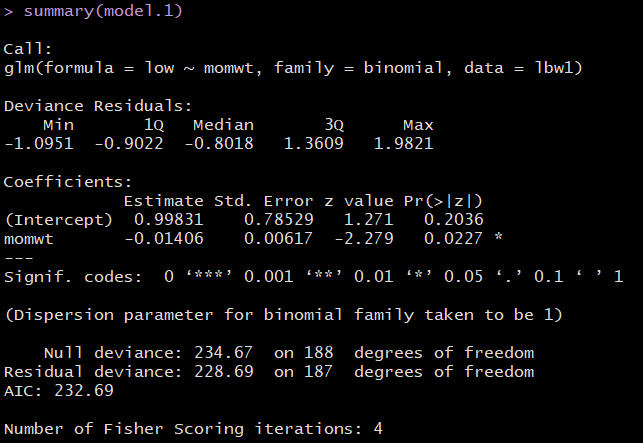
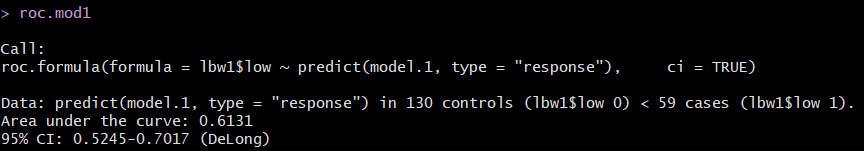
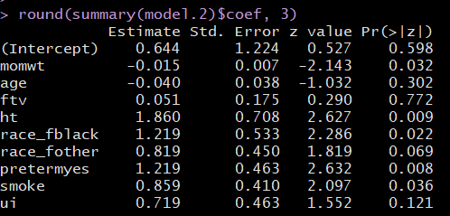

```{r set-options, echo=FALSE, cache=FALSE}
knitr::opts_chunk$set(comment=NA)
options(width = 60)
```

## Setup

```{r, warning = FALSE, message = FALSE}
library(skimr); library(broom); library(janitor)
library(pROC); library(ROCR)  # these are new to us
library(tidyverse)

lbw <- read_csv("data/lbw.csv") %>% clean_names()
```

## The Low Birth Weight data, again

```{r}
lbw1 <- lbw %>% 
    mutate(race_f = fct_recode(factor(race), white = "1",
                               black = "2", other = "3"),
         race_f = fct_relevel(race_f, "white", "black")) %>%
    mutate(preterm = fct_recode(factor(ptl > 0), 
                                yes = "TRUE",
                                no = "FALSE")) %>%
    rename(momwt = lwt) %>%
    select(subject, low, momwt, age, ftv, ht, race_f, 
           preterm, smoke, ui)
```

## The `lbw1` data (n = 189 infants)

Variable | Description
-------: | ------------------------------------------------
`subject` | id code
`low` | indicator of low birth weight (< 2500 g)
`momwt` | mom's weight at last menstrual period (lbs.)
`age` | age of mother in years
`ftv` | count of physician visits in first trimester (0 to 6)
`ht` | history of hypertension: 1 = yes, 0 = no
`race_f` | race of mom: white, black, other
`preterm` | prior premature labor: 1 = yes, 0 = no
`smoke` | 1 = smoked during pregnancy, 0 = did not
`ui` | presence of uterine irritability: 1 = yes, 0 = no

Source: Hosmer, Lemeshow and Sturdivant, *Applied Logistic Regression* 3rd edition. Data from Baystate Medical Center, Springfield MA in 1986.

## Our current model

```{r}
model.1 <- glm(low ~ momwt, data = lbw1, family = binomial)
model.1
```


## Our logistic regression model

The logistic regression equation is:

$$
logit(Pr(low = 1)) = log\left( \frac{Pr(low = 1)}{1 - Pr(low = 1)} \right) = 0.99831 - 0.01406 \times momwt
$$

Suppose, for instance, that we are interested in making a prediction when Mom's weight at her last period, `momwt` = 130 lbs.

So we have:

$$
logit(Pr(low = 1)) = 0.99831 - 0.01406 x 130 = -0.82949
$$

## Obtaining a Prediction from R for Prob(low = 1)

```{r}
model.1 <- glm(low ~ momwt, data = lbw1, family = binomial)
```

To predict on the probability scale, we can use

```{r}
predict(model.1, newdata = data.frame(momwt = 130), 
        type = "response")
```

## Plotting the Logistic Regression Model

We can use the `augment` function from the `broom` package to get our fitted probabilities included in the data.

```{r, eval = FALSE}
mod1.aug <- augment(model.1, lbw1, 
                    type.predict = "response")

ggplot(mod1.aug, aes(x = momwt, y = low)) +
    geom_point() +
    geom_line(aes(x = momwt, y = .fitted), col = "blue") +
    labs(title = "Fitted Logistic Model 1 for lbw")
```

- Results on next slide

## Plotting the Logistic Regression Model

```{r, echo = FALSE}
mod1.aug <- augment(model.1, lbw1, 
                    type.predict = "response")

ggplot(mod1.aug, aes(x = momwt, y = low)) +
    geom_point() +
    geom_line(aes(x = momwt, y = .fitted), col = "blue") +
    labs(title = "Fitted Logistic Model 1 for lbw")
```

## Cleaning up the plot

I'll add a little jitter on the vertical scale to the points, so we can avoid overlap, and also make the points a little bigger.

```{r, eval = FALSE}
ggplot(mod1.aug, aes(x = momwt, y = low)) +
    geom_jitter(height = 0.1, size = 3, pch = 21, 
                fill = "darkmagenta") +
    geom_line(aes(x = momwt, y = .fitted), col = "blue") +
    labs(title = "Fitted Logistic Model 1 for lbw1") +
    theme_bw()
```

- Results on next slide

## Cleaned up Plot of Model 1

```{r, echo = FALSE}
ggplot(mod1.aug, aes(x = momwt, y = low)) +
    geom_jitter(height = 0.1, size = 3, pch = 21, 
                fill = "darkmagenta") +
    geom_line(aes(x = momwt, y = .fitted), col = "blue") +
    labs(title = "Fitted Logistic Model 1 for lbw1") +
    theme_bw()
```

## Plotting a Simple Logistic Model using `binomial_smooth`

```{r, eval = FALSE}
binomial_smooth <- function(...) {
  geom_smooth(method = "glm", 
              method.args = list(family = "binomial"), ...)
}

ggplot(lbw1, aes(x = momwt, y = low)) +
  geom_jitter(height = 0.05) +
  binomial_smooth() + 
    ## ...smooth(se=FALSE) to leave out interval
  labs(title = "Logistic Regression Model 1") +
  theme_bw()
```

## The Resulting Plot

```{r, echo = FALSE}
binomial_smooth <- function(...) {
  geom_smooth(method = "glm", 
              method.args = list(family = "binomial"), ...)
}

ggplot(lbw1, aes(x = momwt, y = low)) +
  geom_jitter(height = 0.05) +
  binomial_smooth() + 
    ## ...smooth(se=FALSE) to leave out interval
  labs(title = "Logistic Regression Model 1") +
  theme_bw()
```

## Studying the Model, Again

```{r}
model.1
```

- logit(Pr(low = 1)) = 0.998 - 0.014 momwt
    + so ... as momwt increases, what happens to Pr(low = 1)?
    + if Harry's mom weighed 130 lbs and Sally's weighed 150 lbs, how can we compare the predicted Pr(low = 1) for Harry and Sally?
    
## Harry (momwt = 130) vs. Sally (momwt = 150)

```{r}
predict(model.1, newdata = data.frame(momwt = c(130, 150)),
        type = "response")
```

- Harry's mom weighed 130 lbs, and his predicted probability of low birth weight is 0.304
- Sally's mom weighed 150 lbs, and her predicted Pr(low = 1) = 0.248

## Interpreting the Coefficients of the Model

```{r}
coef(model.1)
```

To understand the effect of `momwt` on `low`, try odds ratios. 

```{r}
exp(coef(model.1))
```

Suppose Charlie's Mom weighed one pound more than Harry's. 

- The **odds** of low birth weight are 0.986 times as large for Charlie as Harry. 
- In general, odds ratio comparing two subjects whose `momwt` differ by 1 pound is 0.986

## Comparing Harry to Charlie

Charlie's mom weighed 1 pound more than Harry's. The estimated odds ratio for low birth weight from the model associated with a one pound increase in `momwt` is 0.986.

- If the odds ratio was 1, that would mean that Charlie and Harry had the same estimated odds of low birth weight, and thus the same estimated probability of low birth weight, despite having Moms with different weights.
- Since the odds ratio is less than 1, it means that **Charlie** has a **lower** estimated odds of low birth weight than Harry, and thus that Charlie has a lower estimated probability of low birth weight than Harry.
- If the odds ratio was greater than 1, it would mean that Charlie had a higher estimated odds of low birth weight than Harry, and thus that Charlie had a higher estimated probability of low birth weight than Harry.

The smallest possible odds ratio is ... ?

## The rest of the model's output

```
Degrees of Freedom: 188 Total (i.e. Null);  187 Residual
Null Deviance:	    234.7 
Residual Deviance: 228.7 	AIC: 232.7
```

Model                  | Null | Residual | $\Delta$ (`model.1`)
---------------------: | -----: | -----: | -----:
Deviance (lack of fit) | 234.7 | 228.7 | 6.0
Degrees of Freedom     | 188   | 187   | 1

- Deviance accounted for by `model.1` is 6 points on 1 df
- Can compare to a $\chi^2$ distribution for a *p* value via `anova`

AIC = 232.7, still useful for comparing models for the same outcome

## `anova` on a `glm` model

```{r}
anova(model.1)
pchisq(5.9813, 1, lower.tail = FALSE)
```

## `glance` on `model.1`

```{r}
glance(model.1)
```

- Deviance = $-2 \times$ log (likelihood)
- AIC and BIC are based on the deviance, but with differing penalties for complicating the model
- AIC and BIC remain useful for comparing multiple models for the same outcome

## `summary` of `model.1`



## Coefficients output

```
Coefficients:
             Estimate Std. Error z value Pr(>|z|)  
(Intercept)   0.99831    0.78529   1.271   0.2036  
momwt        -0.01406    0.00617  -2.279   0.0227 *
```

- We have a table of coefficients with standard errors, and hypothesis tests, although these are Wald z-tests, rather than the t tests we saw in linear modeling.
- `momwt` has a Wald Z of -2.279, yielding *p* = 0.0227
    + H~0~: `momwt` does not have an effect on the log odds of `low`
    + H~A~: `momwt` does have such an effect
- If the coefficient (on the logit scale) for `momwt` was truly 0, this would mean that:
    + the log odds of low birth weight did not change based on `momwt`,
    + the odds of low birth weight were unchanged based on `momwt` (OR = 1), and
    + the probability of low birth weight was unchanged based on the `momwt`.

## Confidence Intervals for Coefficients

```{r}
coef(model.1)
confint(model.1, level = 0.95)
```

- The coefficient of `momwt` has a point estimate of -0.014 and a 95% confidence interval of (-0.027, -0.003).
- On the logit scale, this isn't that interpretable, but we will often exponentiate to describe odds ratios.

## Odds Ratio Interpretation of exp(Coefficient)

```{r, eval = FALSE}
exp(coef(model.1))
```

```
(Intercept)         momwt 
  2.7137035   0.9860401 
```

```{r, eval = FALSE}
exp(confint(model.1, level = 0.95))
```

```
                2.5 %     97.5 %
(Intercept) 0.6180617 13.6228447
momwt         0.9733982  0.9973535
```

- Odds Ratio for `low` based on a one pound increase in `momwt` is 0.986 (95% CI: 0.973, 0,997).
    + Estimated odds of low birth weight will be smaller (odds < 1) for those with larger `momwt` values. 
    + Smaller odds(low birth weight) = smaller Prob(low birth weight).

## Deviance Residuals

```
Deviance Residuals: 
    Min       1Q   Median       3Q      Max  
-1.0951  -0.9022  -0.8018   1.3609   1.9821  
```

- The deviance residuals for each individual subject sum up to the deviance statistic for the model, and describe the contribution of each point to the model likelihood function. The formula is in the Course Notes.
- Logistic Regression is a non-linear model, and it doesn't come with either an assumption that the residuals will follow a Normal distribution, or an assumption that the residuals will have constant variance, so when we build diagnostics for the logistic regression model, we'll use different plots and strategies than we used in linear models.

## Other New Things

```
(Dispersion parameter for binomial family taken to be 1)

Number of Fisher Scoring iterations: 4
```

- Dispersion parameters matter for some generalized linear models. For binomial family models like the logistic, it's always 1.
- The solution of a logistic regression model involves maximizing a likelihood function. Fisher's scoring algorithm needed just four iterations to perform this fit. The model converged, quickly.

## How Well Does Our `model.1` Classify Subjects?

One possible rule: if predicted Pr(low = 1) $\geq 0.5$, then we predict "low birth weight"

```{r}
mod1.aug$rule.5 <- ifelse(mod1.aug$.fitted >= 0.5, 
                       "Predict Low", "Predict Not Low")

table(mod1.aug$rule.5, mod1.aug$low)
```

This rule might be a problem for us. What % are correct?

## A plot of classifications with the 0.5 rule

```{r, echo = FALSE}
ggplot(mod1.aug, aes(x = low, y = .fitted, 
                     col = factor(low))) + 
    geom_jitter(size = 3, width = 0.1) + 
    geom_text(x = 0.3, y = 0.3, label = "130", 
              size = 7, col = "#F8766D") +
    geom_text(x = 0.7, y = 0.3, label = "59", 
              size = 7, col = "#00BFC4") +
    guides(col = FALSE) +
    geom_hline(yintercept = 0.5, col = "red") + 
    labs(x = "Low Birth Weight (0 = no, 1 = yes)",
         y = "Fitted Prob(Low Birth Weight = 1)")
```

## How Well Does Our `model.1` Classify Subjects?

A new rule: if predicted Pr(low = 1) $\geq 0.3$, then we predict "high risk of low birth weight" and otherwise, we predict "low risk of low birth weight"

```{r}
mod1.aug$rule.3 <- ifelse(mod1.aug$.fitted >= 0.3, 
                       "High Risk of LBW", "Low Risk of LBW")
mod1.aug <- mod1.aug %>% 
    mutate(outcome_f = fct_recode(factor(low), 
                                "Low Birth Weight" = "1",
                                "OK Birth Weight" = "0"),
           outcome_f = fct_relevel(outcome_f, "Low Birth Weight"))

table(mod1.aug$rule.3, mod1.aug$outcome_f)
```

For how many of the 189 births in the data is this classification correct?

## A plot of classifications with the 0.3 rule

```{r, echo = FALSE}
ggplot(mod1.aug, aes(x = low, y = .fitted, 
                     col = factor(low))) + 
    geom_jitter(size = 3, pch = 21, width = 0.15) + 
    guides(col = FALSE) +
    geom_hline(yintercept = 0.3, col = "red") + 
    geom_text(x = 0.3, y = 0.2, label = "51", 
              size = 7, col = "#F8766D") +
    geom_text(x = 0.3, y = 0.4, label = "79", 
              size = 7, col = "#F8766D") +
    geom_text(x = 0.7, y = 0.2, label = "14", 
              size = 7, col = "#00BFC4") +
    geom_text(x = 0.7, y = 0.4, label = "45", 
              size = 7, col = "#00BFC4") 
```


# The C Statistic (Area under the ROC Curve)

## Our Model as Diagnostic Test

We want to assess predictive accuracy of our model. 

- One approach: Receiver Operating Characteristic (ROC) curve analysis.
- A common choice for assessing diagnostic tests in medicine.

Consider two types of errors made by our model, in combination with a classification rule.

- Our model uses Mom's weight at last period to predict Pr(low birth weight).
- Lighter moms had higher model probabilities, so our rule would be: Predict low birth weight if Mom's last weight is no more than R pounds.

But the choice of R is available to us. Any value we select can lead to good outcomes (of our prediction) or to errors.

## Test Results

- One good outcome of our "model/test" would be if the Mom's weight is less than R and her baby is born at a low birth weight.
- The other good outcome is if Mom's weight is greater than R and her baby is born at a non-low weight.

But we can make errors, too.

- A false positive occurs when we predict Pr(low = 1) to be small, but the baby is born at a low birth weight.
- A false negative occurs when we predict Pr(low = 1) to be large, but the baby is born at a non-low weight.

We identify two key summaries:

- The true positive fraction (TPF) for a specific weight cutoff R is Pr(Mom weight < R | baby actually has low = 1).
- The false positive fraction (FPF) for a specific weight cutoff R is Pr(Mom weight < R | baby has low = 0).

## The ROC Curve

Since the cutoff $R$ is not fixed in advanced, we can plot the value of TPF (on the y axis) against FPF (on the x axis) for all possible values of $R$, and this is what the ROC curve is. 

- We calculate AUC = the area under the ROC curve (a value between 0 and 1) and use it to help summarize the effectiveness of the predictions made by the model on the following scale:
    + AUC above 0.9 = excellent discrimination of low = 1 from low = 0
    + AUC between 0.8 and 0.9 = good discrimination
    + AUC between 0.6 and 0.8 = mediocre/fair discrimination
    + AUC of 0.5 = random guessing
    + AUC below 0.5 = worse than guessing

Others refer to the Sensitivity on the Y axis, and 1-Specificity on the X axis, and this is the same idea. The TPF is called the sensitivity. 1 - FPF is the true negative rate, called the specificity.

## A Simulation

```{r}
set.seed(43223)
sim.temp <- data_frame(x = rnorm(n = 200), 
                       prob = exp(x)/(1 + exp(x)), 
                       y = as.numeric(1 * runif(200) < prob))

sim.temp <- sim.temp %>%
    mutate(p_guess = 1,
           p_perfect = y, 
           p_bad = exp(-2*x) / (1 + exp(-2*x)),
           p_ok = prob + (1-y)*runif(1, 0, 0.05),
           p_good = prob + y*runif(1, 0, 0.27))
```


## What if we are guessing?

If we're guessing completely at random, then the model should correctly classify a subject (as died or not died) about 50% of the time, so the TPR and FPR will be equal. This yields a diagonal line in the ROC curve, and an area under the curve (C statistic) of 0.5.

Plot is on the next slide...

## What if we are guessing?

```{r, echo = FALSE}
pred_guess <- prediction(sim.temp$p_guess, sim.temp$y)
perf_guess <- performance(pred_guess, measure = "tpr", 
                          x.measure = "fpr")
auc_guess <- performance(pred_guess, measure="auc")

auc_guess <- round(auc_guess@y.values[[1]],3)
roc_guess <- data.frame(fpr=unlist(perf_guess@x.values),
                        tpr=unlist(perf_guess@y.values),
                        model="GLM")

ggplot(roc_guess, aes(x=fpr, ymin=0, ymax=tpr)) +
    geom_ribbon(alpha=0.2, fill = "blue") +
    geom_line(aes(y=tpr), col = "blue") +
    labs(title = paste0("Guessing: ROC Curve w/ AUC=", 
                        auc_guess)) +
    theme_bw()
```

## Building that ROC curve, Code part 1

This approach requires the loading of the ROCR package...

```{r, eval = FALSE}
pred_guess <- prediction(sim.temp$p_guess, sim.temp$y)
perf_guess <- performance(pred_guess, measure = "tpr", 
                          x.measure = "fpr")
auc_guess <- performance(pred_guess, measure="auc")

auc_guess <- round(auc_guess@y.values[[1]],3)
roc_guess <- data.frame(fpr=unlist(perf_guess@x.values),
                        tpr=unlist(perf_guess@y.values),
                        model="GLM")
```

## Building that ROC curve, Code part 2

```{r, eval = FALSE}
ggplot(roc_guess, aes(x=fpr, ymin=0, ymax=tpr)) +
    geom_ribbon(alpha=0.2, fill = "blue") +
    geom_line(aes(y=tpr), col = "blue") +
    labs(title = paste0("Guessing: ROC Curve w/ AUC=", 
                        auc_guess)) +
    theme_bw()
```

## What if our model classifies things perfectly?

If we're classifying subjects perfectly, then we have a TPR of 1 and an FPR of 0. 

- That yields an ROC curve that looks like the upper and left edges of a box. 
- If our model correctly classifies a subject (as died or not died) 100% of the time, the area under the curve (c statistic) will be 1.0. 

I added in a diagonal dashed black line to show how this model compares to random guessing.


## What if our model classifies things perfectly?

```{r, echo = F}
pred_perf <- prediction(sim.temp$p_perfect, sim.temp$y)
perf_perf <- performance(pred_perf, measure = "tpr", x.measure = "fpr")
auc_perf <- performance(pred_perf, measure="auc")

auc_perf <- round(auc_perf@y.values[[1]],3)
roc_perf <- data.frame(fpr=unlist(perf_perf@x.values),
                        tpr=unlist(perf_perf@y.values),
                        model="GLM")

ggplot(roc_perf, aes(x=fpr, ymin=0, ymax=tpr)) +
    geom_ribbon(alpha=0.2, fill = "blue") +
    geom_line(aes(y=tpr), col = "blue") +
    geom_abline(intercept = 0, slope = 1, lty = "dashed") +
    labs(title = paste0("Perfect Prediction: ROC Curve w/ AUC=", auc_perf)) +
    theme_bw()
```


## What does "worse than guessing" look like?

```{r, echo = FALSE}
pred_bad <- prediction(sim.temp$p_bad, sim.temp$y)
perf_bad <- performance(pred_bad, measure = "tpr", x.measure = "fpr")
auc_bad <- performance(pred_bad, measure="auc")

auc_bad <- round(auc_bad@y.values[[1]],3)
roc_bad <- data.frame(fpr=unlist(perf_bad@x.values),
                        tpr=unlist(perf_bad@y.values),
                        model="GLM")

ggplot(roc_bad, aes(x=fpr, ymin=0, ymax=tpr)) +
    geom_ribbon(alpha=0.2, fill = "blue") +
    geom_line(aes(y=tpr), col = "blue") +
    geom_abline(intercept = 0, slope = 1, lty = "dashed") +
    labs(title = paste0("A Bad Model: ROC Curve w/ AUC=", auc_bad)) +
    theme_bw()
```

## What does "better than guessing" look like?

```{r, echo = FALSE}
pred_ok <- prediction(sim.temp$p_ok, sim.temp$y)
perf_ok <- performance(pred_ok, measure = "tpr", x.measure = "fpr")
auc_ok <- performance(pred_ok, measure="auc")

auc_ok <- round(auc_ok@y.values[[1]],3)
roc_ok <- data.frame(fpr=unlist(perf_ok@x.values),
                        tpr=unlist(perf_ok@y.values),
                        model="GLM")

ggplot(roc_ok, aes(x=fpr, ymin=0, ymax=tpr)) +
    geom_ribbon(alpha=0.2, fill = "blue") +
    geom_line(aes(y=tpr), col = "blue") +
    geom_abline(intercept = 0, slope = 1, lty = "dashed") +
    labs(title = paste0("A Mediocre Model: ROC Curve w/ AUC=", auc_ok)) +
    theme_bw()
```

## What does "pretty good" look like?

```{r, echo = FALSE}
pred_good <- prediction(sim.temp$p_good, sim.temp$y)
perf_good <- performance(pred_good, measure = "tpr", x.measure = "fpr")
auc_good <- performance(pred_good, measure="auc")

auc_good <- round(auc_good@y.values[[1]],3)
roc_good <- data.frame(fpr=unlist(perf_good@x.values),
                        tpr=unlist(perf_good@y.values),
                        model="GLM")

ggplot(roc_good, aes(x=fpr, ymin=0, ymax=tpr)) +
    geom_ribbon(alpha=0.2, fill = "blue") +
    geom_line(aes(y=tpr), col = "blue") +
    geom_abline(intercept = 0, slope = 1, lty = "dashed") +
    labs(title = paste0("A Pretty Good Model: ROC Curve w/ AUC=", auc_good)) +
    theme_bw()
```

## The ROC plot for our Model 1 (code)

```{r, eval = FALSE}
## requires ROCR package
prob <- predict(model.1, lbw1, type="response")
pred <- prediction(prob, lbw1$low)
perf <- performance(pred, measure = "tpr", x.measure = "fpr")
auc <- performance(pred, measure="auc")

auc <- round(auc@y.values[[1]],3)
roc.data <- data.frame(fpr=unlist(perf@x.values),
                       tpr=unlist(perf@y.values),
                       model="GLM")

ggplot(roc.data, aes(x=fpr, ymin=0, ymax=tpr)) +
    geom_ribbon(alpha=0.2, fill = "blue") +
    geom_line(aes(y=tpr), col = "blue") +
    geom_abline(intercept = 0, slope = 1, lty = "dashed") +
    labs(title = paste0("Model 1 ROC Curve w/ AUC=", auc)) +
    theme_bw()
```


## The ROC plot for our Model 1 (Result)

```{r, echo = FALSE}
## requires ROCR package
prob <- predict(model.1, lbw1, type="response")
pred <- prediction(prob, lbw1$low)
perf <- performance(pred, measure = "tpr", x.measure = "fpr")
auc <- performance(pred, measure="auc")

auc <- round(auc@y.values[[1]],3)
roc.data <- data.frame(fpr=unlist(perf@x.values),
                       tpr=unlist(perf@y.values),
                       model="GLM")

ggplot(roc.data, aes(x=fpr, ymin=0, ymax=tpr)) +
    geom_ribbon(alpha=0.2, fill = "blue") +
    geom_line(aes(y=tpr), col = "blue") +
    geom_abline(intercept = 0, slope = 1, lty = "dashed") +
    labs(title = paste0("Model 1 ROC Curve w/ AUC=", auc)) +
    theme_bw()
```

## Interpreting the C statistic (0.613) for Model 1

C statistic | Interpretation
----------: | ---------------------------------------------
0.90 to 1.00 | model does an excellent job at discriminating "yes" from "no" (A)
0.80 to 0.90 | model does a good job (B)
0.70 to 0.80 | model does a fair job (C)
0.60 to 0.70 | model does a poor job (D)
0.50 to 0.60 | model fails (F)
below 0.50 | model is worse than random guessing

## Another way to plot the ROC Curve

If we've loaded the `pROC` package, we can also use the following (admittedly simpler) approach to plot the ROC curve, without `ggplot2`, and to obtain the C statistic, and a 95% confidence interval around that C statistic.

```{r, message=FALSE}
## requires pROC package
roc.mod1 <- 
    roc(lbw1$low ~ predict(model.1, type="response"),
        ci = TRUE)
```



## Result of `plot(roc.mod1)`

```{r, echo = FALSE}
plot(roc.mod1)
```


# Plotting Residuals of a Logistic Regression

## Residual Plots for `model.1`?

- Yes/No outcomes contain less information than quantitative outcomes
- Residuals cannot be observed - predicted
    + There are several different types of residuals defined
- Assumptions of logistic regression are different
    + Model is deliberately non-linear
    + Error variance is a function of the mean, so it isn't constant
    + Errors aren't assumed to follow a Normal distribution
    + Only thing that's the same: leverage and influence

So, plot 5 (residuals/leverage/influence) can be a little useful, but that's it.

- We'll need better diagnostic tools down the line.

## Semi-Useful Residual Plot

```{r}
plot(model.1, which = 5)
```

# Building a Bigger Model

## Model 2: A "Kitchen Sink" Logistic Regression

```{r}
model.2 <- glm(low ~ momwt + age + ftv + ht + race_f + 
                   preterm + smoke + ui, 
               data = lbw1, family = binomial)
```


Variable | Description
--------: | -----------------------------------------------
`low` | indicator of low birth weight (< 2500 g)
`momwt` | mom's weight at last menstrual period (lbs.)
`age` | age of mother in years
`ftv` | physician visits in first trimester (0 to 6)
`ht` | history of hypertension: 1 = yes, 0 = no
`race_f` | race of mom: white, black, other
`preterm` | prior premature labor: 1 = yes, 0 = no
`smoke` | 1 = smoked during pregnancy, 0 = did not
`ui` | uterine irritability: 1 = yes, 0 = no

## `model.2`

```{r, echo = FALSE}
model.2
```

## Comparing `model.2` to `model.1`

```{r}
anova(model.1, model.2)
```

```{r}
pchisq(31.94, 8, lower.tail = FALSE)
```

## Comparing `model.2` to `model.1`

```{r}
glance(model.2)

glance(model.1)
```

## Interpreting `model.2`



- Larger Mom `momwt` is associated with a smaller log odds of LBW holding all other predictors constant.

## Impact of these predictors via odds ratios

```{r, eval = FALSE}
exp(coef(model.2)); exp(confint(model.2))
```

Variable | OR est. | 2.5% | 97.5%
----------: | ------: | ------: | ------:
momwt | 0.985 | 0.971 | 0.998
age | 0.961 | 0.890 | 1.035
ftv | 1.052 | 0.739 | 1.478
ht | 6.426 | 1.662 | 28.187
race_fblack | 3.383 | 1.192 | 9.808
race_fother | 2.269 | 0.947 | 5.597
pretermyes | 3.382 | 1.378 | 8.575
smoke | 2.362 | 1.067 | 5.375
ui | 2.053 | 0.818 | 5.101

- Larger Mom `momwt` is associated with a smaller odds of LBW (est OR 0.985, 95% CI 0.971, 0.998) holding all other predictors constant.
- What appears to be associated with larger odds of LBW?

## ROC curve for Model 2 (Code)

```{r, eval = FALSE}
prob <- predict(model.2, lbw1, type="response")
pred <- prediction(prob, lbw1$low)
perf <- performance(pred, measure = "tpr", x.measure = "fpr")
auc <- performance(pred, measure="auc")

auc <- round(auc@y.values[[1]],3)
roc.data <- data.frame(fpr=unlist(perf@x.values),
                       tpr=unlist(perf@y.values),
                       model="GLM")

ggplot(roc.data, aes(x=fpr, ymin=0, ymax=tpr)) +
    geom_ribbon(alpha=0.2, fill = "blue") +
    geom_line(aes(y=tpr), col = "blue") +
    geom_abline(intercept = 0, slope = 1, lty = "dashed") +
    labs(title = paste0("Model 2: ROC Curve w/ AUC=", auc)) +
    theme_bw()
```

## ROC curve for Model 2 (Result)

```{r, echo = FALSE}
prob <- predict(model.2, lbw1, type="response")
pred <- prediction(prob, lbw1$low)
perf <- performance(pred, measure = "tpr", x.measure = "fpr")
auc <- performance(pred, measure="auc")

auc <- round(auc@y.values[[1]],3)
roc.data <- data.frame(fpr=unlist(perf@x.values),
                       tpr=unlist(perf@y.values),
                       model="GLM")

ggplot(roc.data, aes(x=fpr, ymin=0, ymax=tpr)) +
    geom_ribbon(alpha=0.2, fill = "blue") +
    geom_line(aes(y=tpr), col = "blue") +
    geom_abline(intercept = 0, slope = 1, lty = "dashed") +
    labs(title = paste0("Model 2: ROC Curve w/ AUC=", auc)) +
    theme_bw()
```

## Using `augment` to capture the fitted probabilities

```{r}
mod2_aug <- augment(model.2, lbw1, 
                     type.predict = "response")
head(mod2_aug, 3)
```

## Plotting Model 2 Fits by Observed LBW status

```{r, echo = FALSE}
ggplot(mod2_aug, aes(x = factor(low), y = .fitted, 
                     col = factor(low))) +
    geom_boxplot() +
    geom_jitter(width = 0.1) + 
    guides(col = FALSE)
```

## Residuals, Leverage and Influence

```{r}
plot(model.2, which = 5)
```

## Next Time

- Fitting Logistic Regression models with `lrm`
